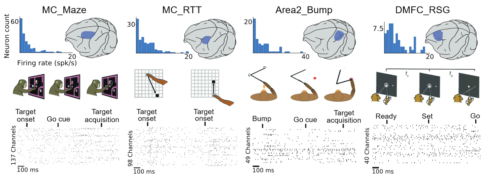

[Neural Latents Benchmark 21--Paper Link](https://arxiv.org/abs/2109.04463)

[Neural Latents Benchmark 21--Github repo docs](https://neurallatents.github.io/)

## 1. 粗读
### Neural Latents Benchmark '21: 评估神经元集群活动的潜变量模型(LVW, Latent Variable Models)
### Abstact 摘要
神经记录技术的进步为更细致地展开神经活动地研究提供了空前的可能性。由于 **LVM 不依赖于外部的经验因素**, 因此是目前最有潜力的可用于分析多种神经系统和行为表现复杂活动的模型。然而，目前 LVMs 的发展**受限于(is currently impeded) 规范标准的缺乏**。因此，本文提出了一个**测试基准(Benchmark)**，它适用于神经活动数据集合上的潜变量模型。这一基准采用无监督框架，涵盖了包括认知功能、躯体感觉、肢体运动等范式在内的数据集，这在(http://neurallatents.github.io)中可以获取到。

### Introduction 介绍
目前，人们采集的神经生理学数据是高维的(high-dimensional), 它捕捉多个脑区在不同行为中的动态数据, 这是只能处理单个或少量神经元记录的传统方法所不能分析的。一个流行且有效的方案是LVM模型, 刻画神经元群体的共变模式以揭示其内部状态(characterizes patterns of covariation across a neuronal population to reveal its internal state), 在总结和可视化神经元群体活动、将活动与行为联系起来以及探究减少群体水平计算的动态机制是有用的(have proven useful for summarizing and visualizing population activity, relating activity to behavior, and interrogating the dynamic mechanisms that mediate population-level computations). 而在研究模型的过程中遇到了数据不标准的阻碍，本文发布的数据集或可解围。神经潜伏期基准测试( Neural Latents Benchmark，NLB )是一系列能够在神经数据上对LVM进行标准化定量评估的基准测试套件。这些套件将提供**精简的数据集、标准化的API和示例代码包**。数据格式是NWB(Neurodata Without Borders format)

目前是第一代, 命名为 NLB'21, 它目标是通过在一系列诸如脑区、行为、数据集大小等因素影响下的数据集上进行无监督的训练以提高LVM的泛用性。在实际研究过程中, 不同的脑区或是不同的行为都会给数据的结构带来迥异的结构特点. NLB '21提供了整理过的数据集, 它们采集自于猴子, 涵盖了运动区、感觉区和认知区等不同脑区, 行为方式包括预计划的、常规移动等等. 另外, 神经生理数据集大小往往各自相差巨大, 这给评估带来了困难, 为了得到一般化的评估结果, NLB评测基准采用了共平滑(co-smoothing)这一标准无监督方式测量模型在神经生理数据集上预测未知部分的能力, 该基准独立于脑区、行为和数据集大小.

### Scientific Motivation and Evaluation Philosophy 动机和理念
LVMs是一种生成模型(generative models)，将观察到的活动描述为潜变量(latent variables)的组合，这些潜变量往往少于观察到的神经元数量，并通常表现出时序性. LVM模型基于这样的假设: 神经元集群放电时各神经元并非彼此独立, 而是处于一种共振荡的模式(coordinated fluctuations). 我们可以把这些神经元集群类比为人工神经网络, 然而, 理解神经元群落要显著难于人工神经网络. 这可能是由于我们往往只专注于一块或者几块脑区而不知道它们之间的解剖意义上是何种连接. 进一步地, 根据已有研究, 观测到的神经反应是高度异化的, 因而从统计学本质上是适合于LVM模型的.

### Related Work 相关工作
1. 应用于神经数据的LVMs评估策略
2. 计算神经科学中的现有基准 有些关注于提取脉冲活动的挑战 其他基准测试评估单个神经元建模来预测锋电位时间
3. 评估生成模型的隐变量和输出 监督评价 通过测量它们相对于数据类别的分离度 在多种下游任务中的迁移表现(transfer performance in a variety of downstream tasks) 其中，外部变量可能是对神经元活动的不可靠或不完整的描述

## NLB数据集说明度量方法
包含4种: MC_Maze MC_RTT Area2_Bump DMFC_RSG

我们认为 spike sorting 和 latent stucture extract 是两个独立的工作, 因而给出的数据集均为经过 spike sorting 后的.
### MC_Maze(Motor Cortical)
|key|val|
|:-|:-|
|实验内容|走出迷宫, 遵循指示延迟范式(instructed delay paradigm)
|控制变量|迷宫障碍数量、终点位置、障碍分布
|实验过程|通过改变各种控制变量得到108种迷宫配置, 进行数千次的实验, 每次随机挑选一种迷宫配置(注意均匀到108个配置)

在指示延迟范式(instructed delay paradigm)中, 基于准备阶段(preparation phase)神经种群的状态, 执行阶段(execution phase)的种群活动在很大程度上是可预测的.

`MC_Maze`: 包含 2869 次 实验(trail), 测量了 192 个 神经元(neuron)
还提供了**放缩版本**:
MC_Maze_L, MC_Maze_M, MC_Maze_S; 它们分别有500, 250, 100个训练样本, 并分别有100个测试集. 另外, 实验条件和神经元数也更少.
### MC_RTT
Maze数据集中, 猴子的行为是 "惯性化的"(sterotyped). 在本实验中, 起点、终点和它们之间的距离都是高度随机的(点到点的), 很少会有重复。spans 15 minutes of continuous reaching, artificially split into 1351 600ms “trials”, and includes 130 neurons and simultaneously monitored hand kinematics.

### Area2_Bump(躯体感觉)
它包含着 来自 somatosensory cortex (躯体感觉皮层) 的数据, 该皮层负责接受和处理 本体感受 或 关于肢体运动 的信息. 数据是在一个简单的视觉引导路径抵达任务
462 total trials and 65 neurons

the manipulandum unexpectedly bumped the monkey’s arm in a random direction before the reach cue, necessitating a corrective response

infer inputs to help describe activity after sensory perturbations, and should also be robust to low neuron counts
### DMFC_RSG
Dorso-medial frontal cortex (DMFC) is a high-level cognitive region, which poses unique challenges for LVMs.

高级认知区域, 数据比前几者都要更不明朗

1289 trials and 54 neurons, and associated task timing, condition, and reaction time information.

High-performing LVMs would likely need to balance input- and internally-driven dynamics, and again be robust to low neuron counts

## NLB数据集: 流水线和测试方法
## 2. 总结
### 第一次

### 第二次

