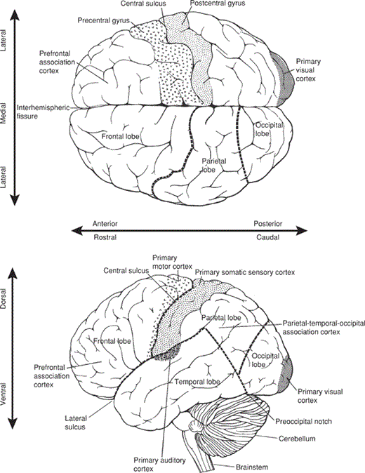
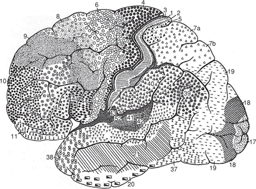
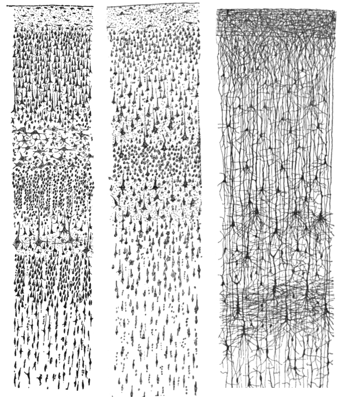
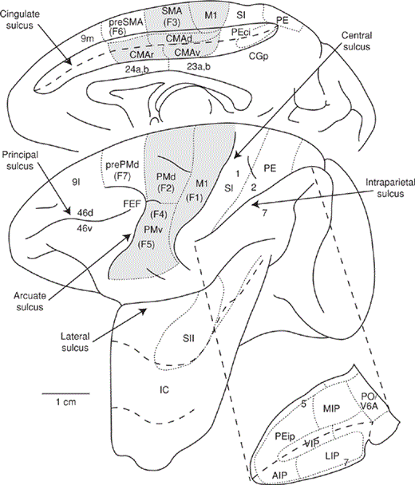
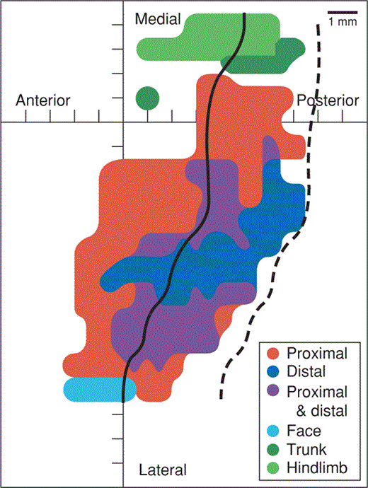
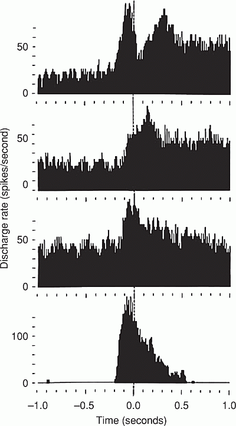
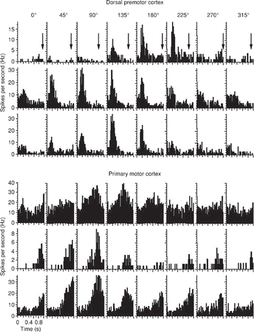
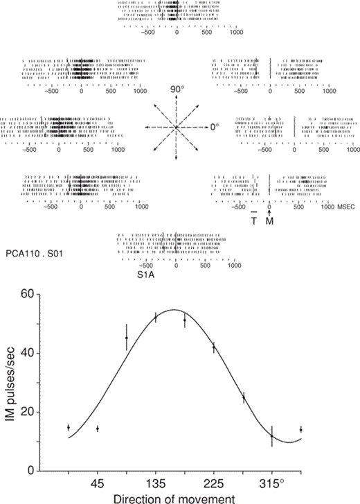
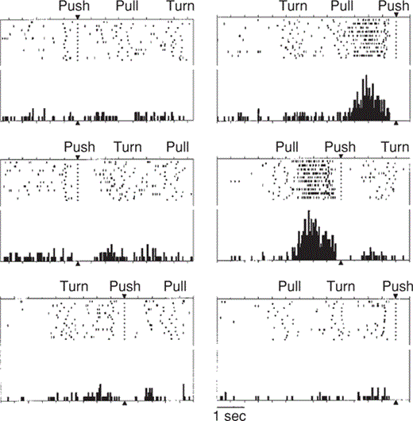
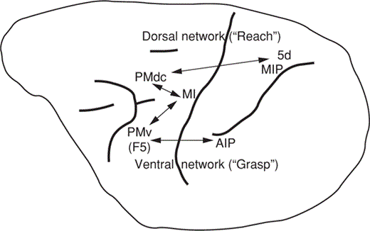

This chapter is organized into six sections. The first four discuss the anatomy and functional roles of the brain areas that are most relevant to the development of brain-computer interface technology. The final two sections discuss the information content of neuronal discharge recorded from these areas and review current methods for recording and analyzing spikes from many cortical neurons simultaneously.

 

action potential(动作电位)
An action potential is a brief (about **1 msec**) and **highly stereotyped fluctuation** in neuronal membrane potential that occurs when **excitatory synaptic(兴奋性突触)** input to the neuron triggers an abrupt, transient opening of channels in the **cell’s membrane(细胞膜)**, through which specific ions(离子) can flow. These action potentials **are actively regenerated(动态再生的)** as they travel down a neuron’s axon(轴突) to provide synaptic input to other neurons. Action potentials are viewed as the basic units of interneuronal communication and information transfer in the nervous system.These seminal neuronal-recording experiments began to reveal the relationships between **neuronal discharge (i.e., spikes)(神经冲动, 或者锋值电位)** in motor and sensory areas of cortex and movements or external sensory events.

 

Terminology for Directions in the CNS(中枢神经系统的方向术语)
>fig. 2.2： Major divisions of the human cerebral cortex in dorsal (from above) and lateral views.
>
>The four major lobes (frontal(额叶), parietal(顶叶), occipital(枕叶), and temporal(颞叶)) are indicated, as well as several of the functionally defined cortical areas. 
1. mediolateral axis (中侧轴)
That is, the zero point of the mediolateral axis is at the midline, and the value rises as distance to the left or right increases. Medial: 内侧, Lateral: 外侧.

2. rostrocaudal axis (喙尾轴)
The rostral (or cranial) to caudal axis (also called the rostrocaudal axis) goes from the head (or more precisely, the face or mouth) to the tail. Thus, the most `rostral` part of the CNS is `the front of the frontal lobe(前额叶的最前端)`, and the most `caudal` is `the end of the spinal cord(脊柱的最末梢)`. 前侧 or 后侧 (喙侧 or 尾侧)

3. dorsoventral axis (背腹轴)
It `is perpendicular to(垂直于)` both the mediolateral and rostrocaudal axes, and goes from the back (or dorsum) to the front (or ventrum). In a biped(双足动物), the rostrocaudal and dorsoventral axes rotate forward, such that **the dorsoventral axis becomes parallel to the gravity vector** (fig. 2.2, lower).

注意以上坐标轴在四足动物和双足动物有所区分, 例如一只鸟(此时喙和尾的命名就合理起来了).

 

Cortex area differentiation
The cerebral cortex of higher mammals is highly convoluted by a set of `gyri (ridges) 脑回, 脊` and `sulci (grooves) 脑沟, 沟` that divide the cortex into distinct anatomical regions. The frontal and parietal lobes are separated by the `central sulcus (CS)中央沟`, which is a deep groove between the cortical folds (called gyri) (fig. 2.2). The frontal lobe lies on the anterior side of the CS and the parietal lobe lies on its posterior side. 

> Figure 2.4. Lateral view of the cerebral cortex from the work of Korbinian Brodmann. Each of the different symbols represents an area Brodmann considered to be anatomically distinct. He identified and numbered a total of more than 50 such areas. 
>
>His numbering is best understood in terms of his sectioning methodology. Unlike modern brain sectioning, which usually proceeds along the rostrocaudal axis, Brodmann sectioned along the dorsoventral axis, so that his areal numbering begins at the top of the brain (i.e., the central sulcus) and often alternates anteriorly and posteriorly as it proceeds ventrally. 

 

表2.1 主要皮层运动区的常见名称及其缩写, 以及所在Brodmann和Mateli分区

Common Name| Common Abbreviation | Brodmann | Matelli
:-:|:-:|:-:|:-:|
Primary motor cortex 初级运动皮层|M1 |4 |F1
Premotor cortex(Dorsal, rostral division) 运动前皮层(背, 喙)|PMdr|6 (6aβ)|F7
Premotor cortex(Dorsal, caudal division)|PMdc|6 (6aα)|F2
Premotor cortex(Ventral, rostral division)|PMvr|6 (6aα)|F5
Premotor cortex(Ventral, caudal division)|PMvc|6 (4c)|F4
Supplementary motor area 辅助运动区|SMA|6 (6aα)|F3
Presupplementary motor area|pre-SMA|6 (6aβ)|F6
Cingulate motor area(rostal division) 扣带运动区(喙)|CMAr|24|24c
Cingulate motor area(caudal division)|CMAc|23|24d
Anterior intraparietal area(前顶内区)|AIP|7
Ventral intraparietal area(腹侧顶内区)|VIP|5/7
Medial intraparietal area(内侧顶内区)|MIP|5|
Parietal reach region|PRR|5|
Primary somatosensory cortex|S1|1, 2, 3|
Prefrontal cortex|PFC|9|
 

The Six Layers of Neocortex
大脑皮层非常薄，平均厚度只有2.5 mm，因此，无论是直接用肉眼还是用影像学的手段如磁共振成像采集图片，都很难观察到其内部的结构。事实上，皮层并不是一个质地均匀的组织，如果我们把一小块大脑皮层放在显微镜下观察，就会发现皮层是具有分层结构的，灵长类动物的大脑皮层一般可以分为六层，位于颅骨下面的是最外层，也就是第一层，最靠近白质的是最内层，也就是第六层，如图所示。

>
>图3 左：人脑的视觉皮层（尼氏染色）；中：人脑的运动皮层（尼氏染色）；右：半个月大婴儿的皮层（高尔基染色）；从图中可以看出，尼氏染色主要染的是细胞体，而高尔基染色主要染的是树突。
>[大脑皮层中各层的分工-知乎](https://zhuanlan.zhihu.com/p/33777233)

Layer I: the outermost layer of the neocortex, is called the `molecular layer(分子层)`. It contains very few neurons and is composed mostly of the dendrites(树突) arising from **`pyramidal neurons`(锥体细胞)** in deeper layers and horizontally running axons(轴突). 
Layer II: is called the `external granular layer(外颗粒细胞层)` and contains mostly `stellate cells(星形细胞)` and small pyramidal cells. 
Layer III: is called the `external pyramidal layer` and contains both small and medium-sized pyramidal cells. **It is the primary source of fibers that interconnect the different areas of cortex.**
Layer IV: is the `internal granular layer(内颗粒细胞层)`. It contains many nonpyramidal neurons and **receives much of the input coming to the cortex**. These fibers that come to the cortex (and are therefore called `afferent fibers(传入神经纤维)`) originate in the thalamus(丘脑) and carry signals from each of the primary senses(基本感受器). 
Layer V is the `internal pyramidal layer(内锥体细胞层)`. It **contains the largest pyramidal cells, the source of the long axons that project out of the cerebrum** (and are therefore called `efferent fibers(传出神经纤维)`). The largest of these Layer V pyramidal cells **are located in the primary motor cortex** and are referred to as `Betz cells` (Betz 1874). Finally, 
Layer VI, called `the multiform layer(多型细胞层)`, contains the greatest variety of cell types. It is the source of most fibers from the cortex (i.e., efferent fibers) to the thalamus.

## Motor Areas of the Cerebral Cortex(大脑皮层的运动区域)
The cerebral cortex is the area of greatest interest in BCI research because it is most accessible to electrode probes and because it is highly involved in the executive function of motor and communication behaviors.

The cortical surface features provide convenient landmarks for the identification of particular regions of the brain(皮层表面的特征为大脑特殊区域的识别提供了方便的标志).

In monkeys, the **small spur extending posteriorly from the arcuate sulcus(从弓状沟向后延展的小骨刺)** (see fig. 2.5), is a useful mediolateral landmark(中侧标志) approximating the region of the cortex that controls proximal arm movements (Georgopoulos et al. 1982). In humans, a distinctive portion of `the precental gyrus(中央前回)` known as the “`hand knob`” marks the region controlling hand movements (Yousry et al. 1997). These landmarks are often used to guide implantation of intracortical electrodes. However, although they are useful for localization during surgery to place electrodes, `the deep sulci` make experimental access to the cortex with multielectrode recording techniques `more difficult`.(然而，尽管它们对于在手术期间放置电极的定位是有用的，但是深沟使得使用多电极记录技术的实验进入皮层更加困难。)

Figure 2.5

猕猴大脑皮质区的鉴定。左为前，右为后。扣带沟和侧沟是展开的，并且每个基底（即，沟的最深部分）由粗虚线表示。顶内沟同样展开，如插图所示。细胞结构区域之间的边界用虚线描绘。M1和运动前区用阴影表示。缩略语：AIP、LIP、MIP、VIP分别位于前、外侧、内侧和腹侧顶内区;CMAd、CMAv、CMAr分别为扣带回背侧、腹侧和喙侧运动区;

### Primary Motor Cortex 初级运动皮质
初级运动皮层（M1）位于额叶，与运动控制密切相关，是脑机接口研究中的重要脑区。Fritsch和Hitzig（ 1870）和Ferrier（ 1873）能够在这个区域用相对较弱的电刺激激活肌肉，因为这里的巨大贝茨细胞的密度相对较大，其轴突形成CST。特别是在灵长类动物中，这些细胞经常直接投射到脊髓运动神经元，这可能有助于它们激活小肌肉组的能力（Lemon 2008）。

图 2.6取自切尼实验室的工作，包含一个类似于彭菲尔德的地图，它显示了代表不同身体区域 的运动区域的空间分布（Park等人， 2001）。

Figure 2.6

管图 2.6的总体特征与图 2.1中的相似（即面部最外侧，腿部最内侧，手和手臂在中间;也参见Sessle和Wiesanger 1982），它缺少单个手指和沿着熟悉的侏儒沟的简单线性映射。

## Cerebral Cortical Areas and Motor Control
大脑皮质区与运动控制：要理解大脑是如何控制四肢的，特别是要理解皮层的作用，**运动层次的概念框架**是非常有帮助的。在这个概念框架中，运动控制被看作是一组功能，分层组织和执行的系列。

运动框架的层级可以沿着至少四个不同的维度来理解：

* time (planning vs. execution) 时间（计划与执行）
* encoding (abstract vs. concrete coding)编码（抽象与具体编码）
* complexity (simple vs. complex movements)复杂性（简单与复杂运动）
* source (external vs. internal movement initiation).源（外部与内部运动启动）。

以这四个维度为指导，我们将考虑本章中描述的六个主要皮层区域：M1、PMd、PMv、SMA、PPC和S1。我们选择这些皮质区，因为它们是特别相关的皮质控制的脑机接口，因为他们密切参与自愿运动的规划和执行(he planning and execution of voluntary movements)

### The Time Dimension: Planning versus Execution
**运动行为可以被看作是一个计划或`准备(preparation)`的过程，然后及时`执行(execution)`该计划**。因为计划先于执行，并且被认为提供了关于运动的更一般、更抽象的信息（见下一节），所以它被视为在运动层次中比执行更高的过程。规划包括几项任务：目标的识别（例如，要达到的目标）;要使用的肢体的选择（例如，右上肢）;并且最后指定到目标的路径（例如，其中手移动以到达目标）。在复杂的、与行为学相关的行为中，通常不可能在时间上将计划与执行分开，因为它们在时间上重叠。**将计划与执行分离的实验方法是指令延迟范式**。在该范例中，首先呈现指导性提示以告知受试者（人或动物）应该执行几种可能的运动中的哪一种。 该提示之后是强制延迟时段（通常为几百毫秒），在该时段期间提示存在并且可以进行规划，但是不允许运动执行。在延迟结束时，开始提示指示受试者进行移动。在一些实验中，通过在延迟时段结束之前移除指令提示来并入需要短期记忆过程的时段。

使用这种模式，研究人员已经能够确定哪些皮质和皮质下区域参与了计划过程。这是通过**检查延迟期间神经活动的调制(the modulation of neural activity)**来实现的。Riehle（ 2005）提出了三个标准，必须满足这些标准，才能将神经活动视为与计划有关: 
1. 在计划期间`相对于基线的尖峰频率调制(modulation of spiking frequency relative to baseline)`必须发生;
2. 这种调制必须与执行提示(go cue)后要做的动作有关;
3. 该调制中的逐个试验变化必须预测运动特征中的逐个试验变化（例如，反应时间、成功或失败）。

#### Primary Motor and Dorsal Premotor Cortices
虽然PM和M1之间有很强的相互联系，电生理数据表明，PM更强烈地参与规划，而M1更密切地参与运动执行。
M1中的调制通常在运动开始前仅50-200毫秒开始，提供了M1参与执行阶段的强有力证据（埃瓦茨;Georgopoulos等人 1982）。如图 2.8所示，不同M1神经元的调制曲线非常不均匀：它们包括瞬时（阶段性）和持续（紧张性）成分，以及增加或减少放电率的各种组合（切尼和Fetz 1980;Kalaska等人 1989）。许多研究还观察到，如果使用指令延迟范例（在运动目标的呈现和随后的运动启动提示之间强制延迟），则可以在启动提示之前观察到早期计划相关的活动（Tanji和埃瓦茨）。该活动已被用于预测即将到来的运动方向（Georgopoulos等人 1989）。

Differing firing-rate profiles of four neurons in the primary motor cortex during a reaching task against a constant load. Each plot represents the average firing rate as a function of time. The onset of movement is at time 0.

Premotor cortex also exhibits rate modulation locked to movement onset. Activity during the delay period is greater in PM than in M1 (Godschalk et al. 1981; Weinrich and Wise 1982; Riehle and Requin 1989; Riehle 1991; Crammond and Kalaska 2000). Moreover, several studies show that preparatory modulation typically occurs earlier in PM (in particular PMd) than in M1 (Riehle 1991; Kalaska and Crammond 1992) (fig. 2.9).

同时记录从三个背侧运动前皮层神经元（PMD）和三个M1神经元在一个八个方向，达到任务。(A)三个PMd神经元（行）的周期事件直方图在每个运动方向（列）的指令延迟周期的开始对齐。箭头指向平均移动开始时间。(B)来自三个M1神经元的事件周直方图。时间零表示两组图的指令提示的开始。注意，PMd神经元在指令延迟期的早期表现出调制，而M1神经元则没有。摘自Hatsopoulos等人（ 2004）。

这些研究结果支持的结论，PM是更密切相关的规划，而M1更密切地参与执行。因此，可以说PM在运动层级中比M1更高（Weinrich和Wise 1982）。同时，数据表明，尽管PM表现出更强和更早的准备活动，但沿着中央前回的喙尾向存在准备到执行功能的梯度（约翰逊等人 1996）。

### The Encoding Dimension: Abstract versus Concrete Coding
编码维度：抽象编码与具体编码
运动可以用不同的抽象层次来描述。这些范围从最抽象的（例如，运动目标本身，由空间中的目标表示），到稍微不那么抽象的（例如，达到目标所必需的手的运动），到最具体的（例如，移动手所必需的肌肉收缩的时间顺序）。生物运动控制理论借用了机器人学的概念，试图阐明这些不同层次的抽象。在机器人技术中，末端执行器的目标和期望的轨迹规划在链接到机器人的固定部分的坐标系中指定。使用用于神经系统的该模型，移动目标或轨迹计划将在自我中心坐标系（即，锚定到身体的坐标系）。 轨迹计划将使用所谓的逆运动学方程进一步从身体坐标变换成关节坐标：
`F[x(t)]=θ(t) (2.1)`
where x(t) is a time-varying vector of end-effector positions, θ(t) is the vector of joint angular positions, and F is a nonlinear function.

因为运动最终由服从牛顿第二定律的力支配，所以关节轨迹使用由逆动力学方程确定的一组扭矩轨迹τ（t）来实现
`G[θ(t),θ˙(t),θ¨(t)]=t(t) (2.2)`
使用这种机器人的观点，一个给定的大脑区域可能代表（或编码）不同层次的运动抽象之一。也就是说，它可能在世界或自我中心坐标中编码抽象目标;它可以在以自我为中心或以关节为中心的坐标中编码手臂和手的运动学;或者它可以编码实现运动学所需的力或肌肉活动。
#### 早期工作
从埃瓦茨（ 1968）的工作开始40年，一直持续到现在，行为电生理学的研究试图确定M1单细胞活动中编码的运动变量。尽管做了很多努力，结果仍然不完全清楚。埃瓦茨的假设是M1代表动力学变量（例如，关节扭矩或其导数），因此对应于等式2.2右侧的最终变换。这一观点得到了他实验室的早期数据以及许多后续研究的支持（Smith等 1975;Hepp-Reymond等人 1978;切尼和Fetz 1980;Kalaska等人 1989;Taira等人 1996;Hepp-Reymond等人 1999;Cabel等人 2001），进一步的支持来自显示神经元群体（即，群体活动）可用于预测握力、关节扭矩或EMG活动（Carmena et al. 2003 ; Westwick等人 2006 ;Pohlmeyer，Solla等人 2007;Fagg等人 2009;Pohlmeyer等人 2009）。

#### 定向调优

现在有强有力的证据表明，M1中的细胞编码代表手在空间中的运动的信号（即，输入到Eq. 2.1），包括关于方向的信息。Georgopoulos及其同事（ 1982）进行了经典实验来验证这一假设。在这个实验中，猴子被要求从一个中心位置向八个外围目标中的一个进行手部运动。大约75%的M1神经元在这些运动中表现出广泛的方向性调谐。也就是说，**每个神经元对一个方向显示出优先响应，称为细胞的首选方向（PD）**。向其他方向移动期间的峰值放电是细胞PD与实际运动方向之间的角度余弦的函数（图 2.10）。定向调谐的存在是一个非常可靠的发现，在M1的许多其他研究中得到了重复，包括二维和三维延伸（Schwartz等人， 1988;Kalaska等人 1989; Maynard等人 1999;Moran和Schwartz 1999）。

来自初级运动皮层（M1）的神经元的方向调谐。(Top面板）光栅图（即，尖峰）。（下图）来自同一神经元的作为方向的函数的平均尖峰速率。使用余弦函数拟合数据。来自Georgopoulos等人（ 1982）。

#### Kinematic Information 运动信息
虽然运动方向已被最广泛地研究，但也有证据表明，M1神经元代表运动的其他运动学特征，包括速度、位置和运动距离（Georgopoulos等， 1984;Fu等人 1993;仓田 1993;Ashe和Georgopoulos 1994;Fu等人 1995;Paninski等人 2004）。在过去的25年中，M1作为运动学信号源的模型已经成为主导观点。除了少数例外（Carmena等人 2003;Pohlmeyer，Perreault等人 2007 ;莫里茨等人 2008;Fagg等人 2009;Gupta and Ashe 2009;Pohlmeyer等人， 2009），它已经用作使用Ml神经元活动来控制运动的所有BCI的基础。

#### Population Vectors 群体向量
Georgopoulos表明，可以将大量神经元的PD和放电速率结合起来预测运动方向（Georgopoulos等人 1986）。这就是所谓的群体向量方法。在通过对应神经元的激发速率对每个PD向量进行加权之后，它简单地取定向调谐的神经元的群体中的优选方向的向量和。使用群体向量方法，Schwartz和同事证明了具有时变方向的更复杂的运动路径也可以被解码（Schwartz 1992;Schwartz和Moran 1999）。这种方法已经用于实时BCI中，以引导虚拟和机器人设备在三维中的移动（Taylor等人， 2002;Velliste等人 2008）。

### The Complexity Dimension: Complex versus Simple Movements
复杂性维度：复杂运动与简单运动
许多日常运动是复杂的，并且可以被视为简单运动的顺序或同时招募。例如，在键盘上打字或弹钢琴需要一系列手指运动，并且伸手抓住物体需要上肢的近端和远端段的协调。此外，双手运动需要两个肢体的协调。在行为层面，复杂的运动通常不仅仅是简单运动的串联，因为一个运动元素可能影响另一个元素的执行。这在协同发音的语言现象中尤其明显，其中一个音素的产生受到产生下一个音素的需要的影响（Daniloff和Moll 1968;Benguerel和科万）。这在钢琴演奏中也很明显（Engel et al. 1997），可能在许多其他复杂的动作中也很明显。 这些行为现象表明，有专门的神经回路将简单的动作联系和协调成更复杂的序列。
#### Supplementary Motor Cortex and Primary Motor Cortex
从Penfield的经典刺激研究（Penfield和Welch 1951）开始，已经认识到皮质的补充运动区（SMA）是涉及多个肢体节段的复杂运动的表示中的重要区域。

单神经元记录已经证明，SMA神经元优先发射复杂的运动序列。相比，简单的运动。在使用一系列手柄推拉运动的任务中，单个SMA神经元仅针对特定的运动序列而被激发，而不是孤立地针对任何单个运动（Shima和Tanji 2000）。例如，如图 2.12所示，每当拉动之后是推动时，一个SMA神经元就会被激发，但当这些运动以其他顺序或与其他运动组合执行时，则不会被激发。

**Figure 2.12**

However, recent studies have called into question. Lu and Ashe demonstrated that M1 neurons preferentially encode specific memorized movement sequences (Lu and Ashe 2005). They also found that injections of muscimol (a drug that inhibits neuronal activity) into M1 increased errors during memorized sequences, without increasing errors in nonsequenced movements.

The electrical stimulation used in Penfield’s experiments was of much greater intensity and longer duration than that typically used in the most recent intracortical-stimulation studies. However, using lengthy stimulation trains (500–1000 msec) and relatively high current intensity to stimulate frontal lobe (including M1) and parietal lobe, Graziano et al. (2002, 2004) **elicited seemingly goal-directed movements that mimicked ethologically relevant behaviors involving complex movements of multiple limb segments(引起看似目标导向的运动——模仿涉及多个肢体节段的复杂运动的行为学相关行为)**. Although the interpretation of these observations is controversial given the large magnitude and long duration of electrical stimulation, **they suggest that cortical control of movement sequences may be distributed `beyond` SMA**. 尽管实验中采取的大幅度和长时间的电刺激使得这些观察结果的解释可能是有争议的，他们认为控制运动序列的皮层可能分布在SMA以外。

### The Source Dimension: External versus Internal Movement Initiation
运动可以由`外部刺激`触发和发起，也可以由动机内部发起。例如，在指示这样做之后，可以在若干其他视觉呈现的对象中伸手去拿并抓住杯子（即，外部启动），或者人们可以简单地决定伸手去拿杯子以满足对其所容纳的热咖啡的需求（即，`内部引发`）。外部启动和内部启动之间的区别在复杂运动的产生中特别明显，**例如演奏乐器所涉及的运动：钢琴演奏者可以根据提供关于按下哪些键、按多长时间以及按什么顺序（即，外部启动）;或者通过反复练习，钢琴演奏者可以在没有外部刺激的支持下记住并产生（即，内部启动）正确的键按压顺序**。

#### Supplementary Motor and Premotor Cortices

实验证据支持存在两个独立的神经回路（SMA和PM），分别为内部引导和外部引导运动提供支持。在行为猴子的电生理实验表明，**SMA是特别重要的内部产生的运动**。Mushiake及其同事训练猴子按不同顺序按下一组按钮（Mushiake等人 1991）。为了训练动物执行特定的按钮按压序列，按钮内的灯以适当的顺序打开以提示每个动作。在几次重复之后，按钮内的灯逐渐变暗，直到它们完全熄灭。大量的SMA神经元仅在灯光熄灭后才开始调节，并在灯光恢复时停止放电。因此，这些SMA神经元被理解为与运动的内部启动有关。**与此相反，涉及PM的第二神经回路（PMd和PMv）似乎参与外部产生的运动**。在相同的实验中（Mushiake等人， 1991），大量的PMd和PMv神经元在灯保持照亮时放电，但一旦灯熄灭就停止放电。相比之下，M1神经元没有区分这两种条件。这项研究表明，区域6（包含SMA和PM皮质的区域）具有专门的内部和外部运动生成回路。相比之下，M1，这是较低的运动层次，不受这种背景差异。

## Visually Guided Reach-to-Grasp (Prehension) Behavior
到目前为止，我们已经描述了基于上述四个维度理解的电机层次结构。这些描述都是概括性的。现在，我们来看看一个具体的例子，即抓握，即伸手去抓住一个物体的行为，看看这些遍布大脑皮层的层级功能是如何导致有目的的运动的。

Prehension(前伸，理解为抓握) is interesting from the perspective of motor control because it is a complex behavior that requires the coordination of proximal and distal components of the arm(需要手臂近端和远端组件的协调). Electrophysiological data(电生理数据) provide some evidence for two cortical networks, one supporting reach behavior and the other supporting grasp.

Figure 2.13

两个神经网络在猕猴皮层分别参与控制近端达到运动和远端抓取运动。背侧伸展网络由上级顶叶皮层（5d区和MIP）、尾侧背侧运动前皮层（PMdc）和初级运动皮层（M1）组成。腹侧抓握网络包括前顶内区（AIP）、头侧腹侧前运动皮质（PMv;F5）和Ml。
背侧网络-包括区域5d（在PPC中）、MIP（内侧顶内区）、PMdc（背侧PM的尾部）和M1-似乎专门用于控制肩部和肘部运动（即，对于到达行为）。来自PMdc和吻侧M1的皮质脊髓投射（即，在中央前回上）主要终止于上颈（即，颈）节段，其含有支配近端肌肉组织的运动神经元池（He等 1993）。 最近的一项电刺激研究表明，在PMD内存在背-腹地形，因此弓形刺上方的刺激主要引起近端手臂运动（Raos等 2003）。相反，包括前顶内区（AIP）、腹侧PM的吻侧部分（PMvr）和M1（特别是埋在中央沟中的M1的尾侧部分）的腹侧网络被假定控制远端运动，例如抓握（Kurata和Tanji 1986;Rizzolatti等人 1988;Jeannerod等人 1995）。AIP和PMvr具有相似的功能特性，包括对抓握物体的视觉和运动反应。毫不奇怪，考虑到AIP接近视觉输入，AIP的放电似乎更多地取决于抓握物体的形状，而较少地取决于抓握的实际细节.

初级运动皮层（M1）明显参与控制手臂运动的远端和近端组件。我们已经描述了证据表明，M1神经元编码各种近端到达运动参数。在有行为的猴子中的电生理学记录还显示，M1中的单个神经元通过远端肢体功能的许多不同方面来调节它们的活动，包括绕腕部的扭矩（埃瓦茨;Murphy等人 1979;切尼和Fetz 1980;仓田 1993;Kakei等人 1999）和握力（Hepp-Reymond等人 1978;Muir & Lemon 1983;Wannier等人 1991;Maier等人 1993）。

猴子的M1或锥体束的损伤引起近端肢体的暂时性轻瘫或麻痹以及精细控制的腕和手指运动的持续丧失（特别是，分离单个手指运动的能力的丧失）（Denny-Brown 1950;Lawrence and Kuypers 1968a;Passingham等人 1978）。使用短刺激串和低电流幅度的M1的皮质内微电极刺激可以引起肩部、肘部、腕部和手指关节周围的肌肉收缩和运动（Asanuma等人 1976;亨特利和Jones 1991;Donoghue等人 1992）。更长的刺激序列（持续几百毫秒）可以引起复杂的、明显目标导向的运动，涉及近端和远端关节，看起来类似于自然的伸手和抓握（Graziano等人， 2002， 2004）。 与这些观察结果一致，许多成像和刺激研究表明，近端和远端代表混合并分布在M1的整个臂区域（亨特利和Jones 1991;Donoghue等人 1992;Schieber和Hibbard 1993;Sanes等人 1995）。

因此，尽管广泛的研究，存在一个严格的地形组织内的手臂地区的M1仍然有些争议。现代刺激研究认为存在同心或马蹄形组织，远端代表主要在M1的尾部（包括中央沟的前堤），被近端臂代表区包围（见图 2.6）（Kwan等人 1978a， 1978b;Park等人 2001;Park等人 2004）。在这两个区域之间是第三区域，其中低电流刺激引起近端和远端肌肉的组合的活动（Park等人 2001）。 这个中间区有两种可能的功能解释：编码远端或近端成分的单个神经元彼此紧密接近地混合，并且可以与电刺激同时被激发;或者，单个神经元编码近端和远端分量。

最近的解剖学研究使用逆行跨神经元狂犬病病毒运输从个别肌肉已经证明，从皮质到脊髓运动神经元的直接投射几乎完全来自中央沟的前堤中的M1的尾部（Rathelot和Strick 2006）。此外，这些研究表明，运动神经元支配近端以及远端肌肉接收这些单突触的预测，并形成一个中间到横向的地形内尾M1，使近端细胞更内侧和远端细胞更横向。因此，尾部M1可能是一个特别重要的区域，用于产生协调的伸手抓握行为。

## Information in Action Potentials (Spikes)

目前流行的观点被称为速率编码假说。它假定信息是通过神经元产生尖峰信号的速率来传递的。速率编码的概念首先由Adrian和Zotterman（ 1926）明确阐述，他们记录了猫腿中皮肤神经纤维的动作电位，因为施加到脚垫的压力是变化的。当尖峰振幅保持稳定时，数秒内计数的尖峰数量与施加的压力成比例。这一观察结果表明，尖峰频率或速率是编码信息的基本机制。这被称为速率编码假设。

由于在该初始研究中使用的秒长时间间隔似乎太长而不能编码与运动行为相关的快速变化的感觉、运动和认知信息，后来的研究者通过考虑能够适应快速变化的小得多的时间窗来改进速率编码假设（里士满等人 1987）。然而，神经元的优选操作时间尺度和用于测量尖峰速率的适当时间尺度仍然未确定。

In many BCI applications, spikes are counted in bins (i.e., time periods) of 20–100 msec (Serruya et al. 2002; Taylor et al. 2002; Carmena et al. 2003; Pohlmeyer et al. 2009). Counting spikes in bins is a common method for estimating firing rates.
然而，该方法具有某些问题。首先，相对于个体尖峰的发生任意地选择区间的时间边界（例如，使得给定尖峰可以跨越两个相邻的仓）。第二，当仓宽度（即，持续时间）被减少以提高时间分辨率，速率分辨率降低（因为速率是以1/binwidth的增量计算的）（Dayan和Abbott 2001）。
在BCI应用中未广泛使用的替代方法是将尖峰序列与高斯或类似滤波器进行卷积，以便将点过程转换成连续速率信号（French和霍尔顿;Dayan和Abbott 2001）。 利用这种方法，高斯滤波器的宽度的作用非常类似于标准分箱中的箱宽度，并且它确定测量发射率的时间分辨率。

### Spike Sorting

在单神经元行为电生理学的大部分历史中，研究人员依赖于单个可移动的微电极，将其尖端定位在一个神经元的细胞体附近，以便选择性地捕获其细胞外电压波形。然而，最近，随着多电极技术的出现，隔离单个神经元并不总是实用的，因为将每个电极定位成靠近单个神经元太耗时，或者因为电极被刚性地固定在一个位置并且可能靠近或可能不靠近特定神经元。为了解决这个问题，在过去的十年中，用于识别单个神经元的尖峰的复杂算法在微电极电生理学中已经变得普遍。这个过程被称为尖峰分选，并且已经出现了描述许多不同方法的相对大量的文献。 （参见（Lewicki 1998）的综述）。

所有尖峰排序算法的基本假设是，来自单个神经元的尖峰的大小和形状是高度定型的，并且与来自其他神经元的尖峰不同。因此，所有算法都是从根据一些特征集表示尖峰波形开始的。最简单的是尖峰电压随时间的波动。可以从几分钟的记录数据中选择这些波形的代表性示例的集合，并且可以计算平均波形并将其用作模板以对后续尖峰进行排序。随后收集的每个尖峰可以与具有多个不同相似性度量中的任何相似性度量的每个模板波形进行比较。如果匹配足够接近，则假定其是从对应的模板神经元生成的（Tolias等人， 2007;Rebesco等人 2010）。

另一种方法是使用适当的降维基集来表示尖峰波形。例如，假设以40kHz对动作电位采样1.5毫秒，则每个动作电位有60个电压值。鉴于动作电位在时间上是高度自相关的，信号的维度可以使用称为主成分分析（PCA）的分析技术（第7章）从60维减少到可能的二维或三维，同时仍然解释了单个尖峰的大部分方差。或者，可以定义一小组任意选择的特征（例如，尖峰宽度、峰谷振幅或峰电压时间）。通过将动作电位波形投影到低维空间中，通常会出现不同的簇，每个簇可能对应于单个神经元。 在称为簇切割的过程中，可以手动定义分离簇的边界，使得通常可以从单个微电极分离多个神经元。

随着允许同时记录100个或更多个神经元的多电极方法的日益使用，手动尖峰辨别方法已变得极其繁琐或完全不切实际。已经开发了自动化方法来解决该问题并消除手动方法的主观性特征（Wood等人 2004）。非参数聚类算法（例如，k均值或模糊聚类）可以自动发现PCA或特征空间中自然出现的聚类之间的分区。然而，这些方法中的许多方法具有固有的弱点，因为它们需要对簇的预期数量的先验知识（Lewicki 1998）。已经开发了更强大的尖峰排序算法，其也可以估计数据集中不同簇的数量（Lewicki 1994;Wood and Black 2008）。 通过使用贝叶斯规则（参见第8章），给定尖峰波形属于特定簇的概率可以用于将尖峰分类到不同的簇中。

