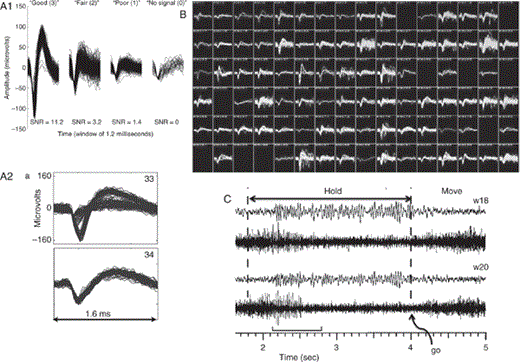
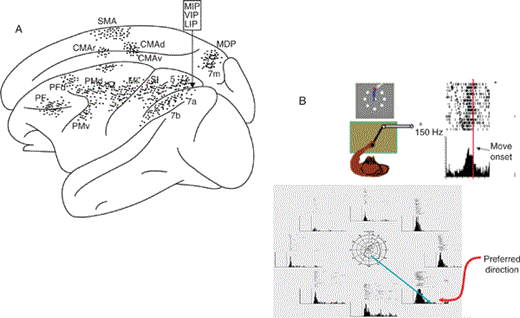
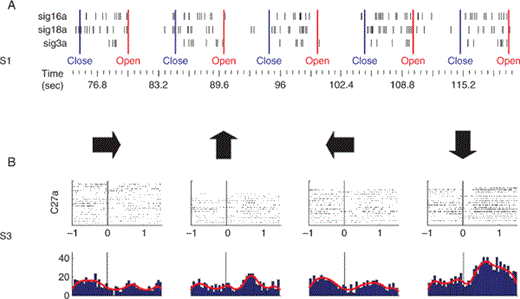
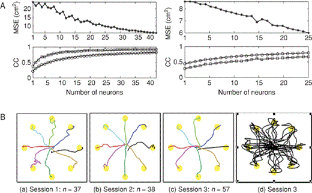

从皮层神经元记录的尖峰可能用作BCI输出信号的第一个证据来自Eberhard Fetz和合作者的开创性工作，他们在20世纪60年代末和随后的几年中表明，猴子可以学会使用单个神经元来控制仪表针以获得食物奖励（Fetz 1969;Fetz和Finocchio 1972）。这些开创性的研究提供了关键的初步证据，表明来自运动皮层的信号可以真实的用于控制物理系统，从而预示了25世纪后闭环多神经元控制的演示。后来的工作，反过来，重新点燃了学习一个神经元单独可以提供多少控制的兴趣（莫里茨et al. 2008）。第二个里程碑是群体编码概念的引入，即运动皮层中神经元群体提供平滑控制信号的能力（Humphrey等，1970;Georgopoulos 1988）。
无论BCI记录FP还是尖峰，它们都需要处理（例如，滤波、放大等）记录的信号并将它们解码成可用于控制设备的命令。由于iBCI使用在其源处获取的信号（即，在大脑内），希望它们将产生比eBCI更好的设备控制：iBCI将实现更复杂的控制（即，更多的自由度）;能够控制多个身体部分（例如，多肢）;并且使用起来更自然。然而，与此同时，对iBCI传感器的独特要求以及它们记录的信号的性质也带来了挑战，这些挑战在几个方面与eBCI的要求不同。在iBCI中实现稳定、可靠的信号方面已经取得了很大进展，结果令人鼓舞。本章描述了迄今为止开发的iBCI，并解决了其进一步开发中涉及的问题，以及有关生物相容性、设计、可靠性和信号特性的问题。 

## Goals in Development of iBCI Systems
由于iBCI使用植入大脑中的传感器并记录相对较小的神经元群体的活动，因此iBCI研究和开发的一些目标是iBCI所独有的。iBCI开发的目标包括：
* 为了证明从有限的神经元群体记录的信号提供复杂控制的能力（例如，光标移动或肢体移动）
* to establish the range of functionally useful actions that iBCIs can restore to people who are paralyzed
* 确定iBCI相对于eBCI的优势和益处，eBCI不需要在大脑中植入传感器
* 开发可以可靠稳定运行多年的iBCI

这些目标正在通过动物研究（主要是猴子和大鼠）和严重运动障碍患者的早期人体临床试验来实现。动物模型对于开发和测试新的传感器设计（包括设备-组织相互作用）和解码算法是重要的，并且它们还有助于对运动的神经元控制的新理解。

## Complex Control from Small Populations of Neurons
来自几个几乎完全身体瘫痪的人的初步数据（例如，由于高水平脊髓损伤或中风）已经发现，来自运动皮层的手臂区域的尖峰模式甚至可以在损伤后数年提供有用的命令（Hochberg等， 2006;Kim等人 2008 ;Truccolo等人 2008 ;Simeral等人 2011）。 四肢瘫痪的人已经提供了简单的演示，展示了他们通过计算机界面打字和交流的能力，控制机器人肢体以再现手臂动作，以及操作其他潜在有用的技术。到目前为止，iBCI是唯一已经证明四肢瘫痪的人能够实现对计算机光标或其他设备（例如，Hochberg等人 2006）。

## Key Features of an iBCI
与所有BCI一样，iBCI有三个基本组件：记录大脑信号的传感器（参见本卷第5章和第6章），信号处理的方法（即，特征提取和转换）（参见第7章和第8章），以将信号解码成命令，以及实现命令的应用设备（参见第11章）。iBCI和eBCI之间最显著的差异来自它们的传感器。而eBCI使用位于大脑外部的传感器（例如，如在EEG中在头皮上或如在ECoG中在皮层表面上），iBCI使用穿透到大脑中（通常进入大脑皮层中）的传感器。因此，iBCI可以记录两类信号：单神经元动作电位（尖峰）;场电位（FP）。相比之下，eBCI仅记录FP。iBCI传感器可以同时记录来自细胞外空间的场电位（FP）和动作电位。场电位包括0-0。2 kHz的电位，由于电流通过许多神经元的体树突膜。相比之下，尖峰是在单个神经元的轴突丘处产生的更高频率（1 kHz）的短暂（1毫秒）全或无脉冲（图2和3）。 16.1和16.2）。尖峰是神经元输出的量度，神经元的神经信息携带产物，其通常经过长距离传递到其他大脑区域。(z值得注意的是，由iBCI记录的神经元尖峰不应与在EEG或ECoG中看到的与癫痫发作相关的尖峰混淆。后面的尖峰反映了许多神经元的同步活动。)

Figure 16.1

来自运动皮层的动作电位（尖峰）。
(A)通过长期植入的Si平台多电极阵列记录来自初级运动皮层中的单个神经元的尖峰。A1示出了可以从这些阵列检测到的尖峰信号的不同质量（从高到低）。A2（顶部迹线）示出了在同一电极上同时记录的两个尖峰，其中可以理解两个神经元之间在尖峰形状以及幅度上的差异。
(B)植入猴初级运动皮质23个月后，Si平台阵列的96个微电极中的每一个的同时记录（Donoghue实验室，未发表的数据）。每个框是来自单个电极（通道）的信号。
(C)两种类型的电位（尖峰电位和局部场电位（LFP））可从实质内微丝获得。每对迹线显示来自猴初级运动皮层中的来自相同通道的微丝的记录。每对的顶部迹线经低通滤波（0.3-100 Hz）以显示LFP信号，而底部迹线显示经高通滤波（300- 7.5kHz）的相同信号以显示多单元活性（MUA）。这里，在移动手腕的提示之前，猴子在两条垂直虚线之间不动（即，“Go”）。注意，MUA与LFP没有可预测的相关性

### Action Potentials (Spikes)
神经元尖峰作为iBCI信号源是非常感兴趣的，因为它可能是丰富的信息源。对于所有能够发出尖峰信号的神经元，尖峰信号通常被认为是长距离、高内容通信的主要信息输出，并且是神经系统中编码的主要形式（Shadlen和Newsome 1998）。尖峰速率（特定间隔或相关数学函数中的尖峰的数量）通常被认为表示神经输出信息，尽管附加信息可以在尖峰序列的高阶统计中可用，诸如它们的相对定时。

即使是一个神经元的尖峰活动所提供的运动信息量也令人印象深刻：它包括关于未来运动和运动参数的信息以及关于未来运动序列和目标的更高阶信息。手的速度、位置、力、目标和其他变量都可以从运动皮层中的单个神经元收集，从而允许从健全猴子中记录的神经元群体准确重建正在进行的手轨迹（Scott 2008;Kalaska等人 1997;Georgopoulos 1988）（见第2章）。更高层次的信息，如目标、即将到来的手部运动计划以及肢体运动学，也可以从与初级运动皮层连接的顶叶和额叶区域（图 16.3A中的M1）中的尖峰信号解码（Achtman等人， 2007;Pesaran等人 2006;Scherberger & Andersen 2007）（参见第17章）。

Figure 16.3

来自大脑皮层的手臂运动信号。
(A)额叶和顶叶区域的尖峰活动有关的手臂运动已被发现在完整的行为猴子。点画指示每个皮质区域中的点（例如，M1，PM），其中已经记录了单个神经元，其随着运动运动学（以及对于一些区域，力、目标、计划和其他特征）而调节。
(B)猴子M1在到达过程中的运动相关尖峰活动。
(**Top left**) Cartoon of monkey performing **a "center out" reaching task**; movement goals (all possible targets, white; current target, red) are presented on a vertically presented monitor. The monkey directs the cursor to the selected target by making arm movements from the center hold zone to one experimenter-selected target.
(**Top right**) Raster plots and summary histogram show that spikes rates for **this M1 neuron increase ∼150 msec before movement** and in association with movement. Each raster line is one trial; the trials are aligned on the start of movement (vertical bar is at 0, each time tick is 100 msec, y axis is spikes/sec).
(**Below**) Directional tuning for one M1 neuron.Each raster plot and summary histogram shows the firing of a neuron during movement to one of eight targets (as shown in B, above). 注意，该神经元对于向下和向右的移动（即，其优选方向），并且当运动偏离该方向时其活性减弱。利用余弦函数可以很好地拟合放电数与运动方向的平滑相关关系，可以作为由放电率预测运动方向的模型（第二章）。 定向调谐的神经元群体提供了对实际运动方向的可靠估计，其可以用作iBCI的控制信号

尖峰的离散性质，加上需要区分不同神经元产生的尖峰（称为尖峰分选），需要与用于FP的处理不同的处理，FP是连续的低频信号。如第7章所述，尖峰数据可以作为离散时间序列进行处理，使用用于此类分析的各种方法。同时，尖峰记录对传感器提出了特殊要求。它们必须非常小，它们必须在不适宜居住的（即，温暖和离子）环境中，它们必须不产生感染，它们必须保持靠近产生尖峰的神经元，并且它们必须不杀死神经元或诱导瘢痕形成（即，神经胶质增生），降低或阻止尖峰记录（见第5章）。 此外，由于尖峰记录需要比FP记录高得多的采样率，所以iBCI的数字化和功率需求是相当大的。这种高功率要求增加了实现对于非常长期使用至关重要的完全可植入系统的挑战。然而，微型电子技术的快速发展正在迅速减少这个问题的重要性（第5章）。此外，由于尖峰记录需要比FP记录高得多的采样率，所以iBCI的数字化和功率需求是相当大的。这种高功率要求增加了实现对于非常长期使用至关重要的完全可植入系统的挑战。然而，微型电子技术的快速发展正在迅速减少这个问题的重要性（第5章）。This collective information coding by populations of neurons is often called *a population or ensemble code*. It is this code that has the potential to provide real-time estimates of intended movements for iBCIs.

### Multiunit Activity
从不同神经元细胞外记录的神经元锋电位通常在形状和振幅上彼此不同（图 16.1）。主要在短期实验室设置中使用的可移动微电极可以被调整以聚焦于特定神经元，并且因此可以最大化信噪比并且增加正在评估该单个神经元的特性的确定性。然而，大多数iBCI使用相对固定位置的微电极，它们记录的尖峰通常很小，并且多个神经元的尖峰可能会混合在一起（图 16.1A）。因此，分离来自不同神经元的尖峰通常是困难的。因此，应用复杂的软件来提取尖峰波形的特定特征，并使用它们来分离不同神经元的尖峰。这就是所谓的尖峰排序（见本书第7章）。Nevertheless, low-amplitude noise-ridden recordings may be difficult to process in this way, either manually or with automated software.

或者，神经元尖峰可以被视为多单位活动（MUA），而不被分类到单个神经元中（图 16.1C）。 Although the complex mixtures of neurons that comprise MUA make it less useful for basic-science studies of neural information codes, it appears that effective iBCI operation may not require the careful spike-sorting that is essential for characterizing neural information processing (Cunningham et al. 2009; Wood et al. 2004).因此，对于iBCI，MUA可以是不太倾向于信号非平稳性同时保留尖峰信号中存在的唯一信息的有效信号。

一般认为，在来自警觉灵长类动物（包括人类）的初级感觉运动皮层的所有类型的FP记录中，三个主要频带是显而易见的：低频（8-Hz）带，可包含不同的运动或事件相关电位（ERP）;包含μ节律和β节律活动的中频（8-30 Hz）频带（见第13章）;和高频（〉30-Hz）伽马带（见第15章）。μ、β和γ节律统称为感觉运动节律。（Waldert等人 2009和Zhuang等人 2010中提供了这些信号的良好比较。尽管这些频带（以及其中的其他频带）之间的确切关系是一个新的激烈研究领域，但低频带与突触输入最相关，高频带与尖峰信号最相关，而中频带似乎与注意力或其他更全局的信号有关（Belitski等人， 2008）。

## Selection of the Cortical Area for Implantation
植入皮质区域的选择
人体M1臂区域的解剖位置由称为旋钮的独特解剖特征指示，旋钮是中央前回的一部分，并且在标准MRI中很容易看到（Yousry等人 1997），便于iBCI阵列的手术植入。在猴子的iBCI研究中，对与手臂控制相关的神经元的关注主要来自大量关于熟练使用手臂与皮质运动区神经元活动之间关系的文献（见第2章）。这篇文献尤其丰富地论述了初级运动皮层在手臂功能中的作用（例如，多个运动维度的神经元群体编码[Paninski等人 2007]）。先前的研究还揭示了在手臂控制中重要的其他皮层区域 的位置（例如，图 16.3）。在猴子中，已知超过10个明确的区域参与手臂运动的规划或产生（Kalaska & Crammond 1992）。 这些领域中的每一个作为iBCI的信号源的相对优点和缺点仍然在很大程度上未被探索。
与对手臂运动控制的关注相比，对腿部皮层控制的关注要少得多，这可能是由于涉及高度控制的腿部运动的实验难度更大，以及参与腿部运动的深层中线皮层区域的可及性更差。然而，Fitzsimmons等人（ 2009）最近研究了猴子腿部运动的解码，并显示了解码这些运动的潜力。对于什么是控制信号的理想解剖学来源以及是否存在理想来源，没有达成共识。
**由于许多不同的大脑区域以复杂的方式相互作用以产生输出，因此来自多个区域的信号可能很重要，每个区域都可以提供自己的控制信号，并可能做出独特的贡献。由于迄今为止大多数iBCI研究使用来自M1和密切相关的运动区域的信号，因此我们将重点关注这些。**
顶叶皮层和其他区域在iBCI中的应用将在本书第17章中讨论。

### iBCI Studies to Date in Nonhuman and Human Primates
迄今为止在非人类和人类灵长类动物中的iBCI研究
越来越多的成功的多电极阵列作为慢性记录设备在猴子的皮层，大量的知识手臂运动编码的神经元群体在初级运动皮层，以及猴子和人类之间的解剖和功能的相似性，都大大有助于成功和兴趣的发展iBCI使用记录从运动皮层。到目前为止，所展示的紧急iBCI系统在它们所采用的传感器类型、它们的解码算法以及它们输出的用途方面彼此不同。这些努力大多侧重于实现军备控制或类似军备的控制。这些系统已经应用于猴子（例如，Velliste等人 2008）和患有四肢瘫痪的人（例如，Hochberg等人 2006）。 这些研究工作已经产生了一系列的闭环演示的能力，iBCI实现连续控制计算机光标，操作物理机器人系统，并控制肌肉。

为了在猴子中创建瘫痪的实验模型，可以通过可逆的药理学外周神经阻滞来防止肌肉激活。在莫里茨等人（ 2008）和Pohlmeyer等人（ 2009）进行的研究中，尽管存在这种药理学诱导的CNS与肌肉的断开，但猴仍能够产生有用的控制信号。当皮层神经元用于控制肌肉的电刺激时（即，皮质神经元基本上重新连接到它们的预期肌肉目标），这些动物有可能学会执行简单的肢体运动（莫里茨等人 2008;Pohlmeyer等人 2009）。莫里茨等人（ 2008）也表明，仅来自一个或两个皮层神经元的活动就足以控制简单的动作。 因此，这些在暂时瘫痪的猴子中进行的iBCI研究表明，瘫痪的人类可能能够使用皮层神经元来控制机器人手臂等设备的运动，甚至是他们自己肢体的运动。与此同时，目前还不知道该模型在多大程度上准确地捕捉了长期瘫痪的人的神经系统状态。

人类中iBCI的第一次研究由Philip Kennedy及其同事在20世纪90年代后期开始（Kennedy和Bakay 1998;Kennedy等人 2000）。他们的第一项研究表明，患有ALS的人可以有意地调节由运动皮层中的两个锥体电极记录的尖峰活动（Kennedy和Bakay 1998）。在第二项研究中，一个被脑干中风锁定的人（即，除了有限的眼球运动之外完全瘫痪）使用由一个锥形电极记录的尖峰在一个方向上移动光标（即，0.5-尺寸控制）（Kennedy等人 2000）。(In在这种情况下，为了证明神经控制可以与剩余的运动分离，参与者首先在4个月的时间内学习将眶周肌肉的收缩与尖峰速率的调制分离。这项最初的人类iBCI试验证明了使用神经信号控制计算机光标的能力。

手臂和手的神经活动，从M1皮层的四肢瘫痪的人记录与长期植入的多电极阵列在想象的上肢运动。(A)3个M1神经元在连续的口头请求中想象闭合或张开手（S1，脊髓损伤）的尖峰的光栅图。请注意，每个神经元的尖峰与想要合上手的意图有着明显的相关性。(From Hochberg等人 2006.）(B)脑干中风后四肢瘫痪的人的M1神经元的定向调谐（S3）。光栅示出了在重复的单次试验期间，当参与者被指示想象右、上、左或下手臂运动时的发射，如箭头所示。直方图示出了每个方向的试验的总和活动（以赫兹为单位的发射率;时间（秒）;0 =口头请求的时间;红线=平滑速率）。 注意，想象手臂伸展的定向调整类似于健全猴子的伸展动作（与图1#16.3比较）（另见第2章）。

使用皮层神经元群体的人类iBCI系统的第一个试点研究开始于2004年（Hochberg等人 2006），并且使用植入M1的臂区域（即，旋钮）（Yousry等 1997）。在撰写本文时，已经有四名四肢瘫痪患者植入了这种最初的BrainGate系统1（FDA批准将其作为研究器械进行研究）。其中两人患有高颈脊髓损伤，一人患有ALS，一人患有脑桥中风。结果显示，神经元尖峰和LFP在所有四个人的M1臂区域中持续存在，甚至在麻痹发作后数年（Hochberg等人， 2006;Truccolo等人 2008 ;Kim等人 2008;Simeral等人 2011）。 此外，最重要的是，M1神经元立即被想象肢体动作所吸引：即使没有任何实际的动作，也没有学习或练习，想象动作的行为也能立即改变皮层神经元的活动。这是值得注意的，因为这些人在2-9年内没有自愿移动他们的手臂。尽管多年的不使用，神经元尖峰和LFPs中发现M1孔许多相似之处，发生在健全的猴子M1手臂地区。很容易检测到与想象的运动方向良好调谐的皮层神经元（例如，图 16.4）。BrainGate2是第二个更大的试验，涉及多达15名参与者，于2009年开始。其设计用于评估植入阵列的长期安全性、稳定性和可靠性，在高水平脊髓损伤或脑干卒中后或在退行性疾病（例如，脑卒中）中发现的神经元活动的质量和数量。ALS），以及控制辅助设备的可能性，例如打字界面或机器人助理。

### Long-term Performance of iBCIs
最近的一项临床前研究（Suner等人 2005）报告了平台阵列具有良好长期性能的可能性的令人鼓舞的证据。该阵列用于分别记录三只猴子在514天、154天和83天期间的信号（图 16.6）。信号的数量和形式每天都在变化，但没有证据表明记录的神经元数量与时间相关。在最初的几周里，记录是最不可靠的，一个阵列的可靠性增加，一个下降，一个保持大致稳定。

第一次BrainGate试点临床试验的经验与平台阵列可以长期可靠运行的结论一致。试验中的所有四名参与者（四肢瘫痪的人）都将平台阵列植入运动皮层的手臂区域中（Hochberg等人 2006;Truccolo等人 2008 ;Kim等， 2008），并且在植入后至少10个月记录尖峰。在撰写本文时（植入后近5年），其中一名参与者仍在研究中（图1和2）。B和16.8），并且继续记录尖峰。（此外，在这四个人中，在总计〉2800天的植入期[7.7年]中，没有发生感染，无论是在中枢神经系统还是在皮肤中。

使用iBCI系统进行控制。(A)从M1神经元的小群体解码运动（来自Wu等人 2006）。图中显示了两只猴子在中心向外任务中成功解码手臂伸展运动（见图 16.3），作为所用神经元数量的函数。上图显示了与理想（直线）路径的均方误差偏差，下图显示了作为神经元数量的函数的互相关系数。根据猴子的不同，表现似乎在大约25-40个神经元时渐近线。(B)图a-c示出了在需要将光标从中心保持区移动到外围目标的中心向外任务中来自四肢瘫痪的人的Ml神经元群体的平均解码轨迹的示例。对于所进行的所有移动，连续地重复动作（没有中断），但是为了清楚起见，仅示出了向外的路径。面板d显示了一个会话的每个路径。(Data以及Kim等人 2008的图）。

Thus, only two iBCI sensor types have been **tested in human for prolonged periods**: the Si-platform array (Hochberg et al. 2006) and the glass-cone electrode (Kennedy et al. 2000). Both are in pilot trials under an Investigational Device Exemption (IDE) from the Food and Drug Administration (FDA) (see chapter 21). Data from only a few humans, with only a few time points, are currently in the literature.

最影响iBCI传感器长期性能的变量可以分为三大类：
* Movement (the extent to which physical forces cause motion of the electrodes relative to the surrounding brain tissue)
运动（物理力导致电极相对于周围脑组织运动的程度）
* Biocompatibility (the ability of the tissue to accept the device, i.e., the extent of tissue damage and/or tissue responses that encapsulate the electrodes and impair their recording capacity)
生物相容性（组织接受器械的能力，即，封装电极并损害其记录能力的组织损伤和/或组织反应的程度）
* Biostability (the ability of the implant to resist damage by the body’s environment and to resist material failure during long-term use).
生物稳定性（植入物在长期使用期间抵抗身体环境损伤和抵抗材料失效的能力）。

## Decoding the Neuronal Spikes Recorded by iBCIs
解码iBCI记录的神经元锋电位

所有的脑机接口都需要将它们记录的大脑信号转换成命令信号，以实现用户的意图，例如在哪里或如何移动光标、手臂或轮椅。因此，每个BCI必须确定其大脑信号与用户意图之间的关系（Donoghue等人， 2007;Serruya等人 2003）。如前所述，iBCI传感器可以记录神经元尖峰（单单位活动）和局部场电位（LFP）。解码尖峰和场电位的方法，包括LFPs，在本卷的第7章和第8章中进行了广泛的讨论。尽管已经在猴子中探索了使用来自相同iBCI电极的神经元尖峰和LFP两者的可能性（Hwang和Andersen 2009），但是大多数注意力都集中在用于iBCI控制的尖峰上。因此，在本节中，我们回顾用于解码尖峰的方法。

尖峰由离散事件组成，通常包括来自多达100个或更多个个体神经元的贡献，这些神经元可以组合以产生有用的输出信号。解码来自运动皮层的尖峰极大地受益于对初级运动皮层中的神经元活动（即，MI）和手臂运动（Kalaska & Crammond 1992）（例如，图 16.3）（见第2章）。在运动皮层中很容易发现显示方向和速度调谐到手臂伸展的神经元尖峰序列。因此，即使是通过固定的植入电极阵列对神经元进行随机采样，也可以提供丰富的神经元样本，这些神经元针对方向和手速进行余弦调谐（Maynard等人， 1999）（第2章）。这样的神经元的尖峰序列提供可以用于提供手位置和/或速度的连续重建的信息。事实上，M1神经元的小群组的简单线性组合可以在完整的猴子中产生手轨迹（方向和速度）的准确预测（例如，Moran & Schwartz 1999）以及瘫痪人类的想象运动（参见Hochberg等人 2006）（图1A和1B）。 16.1和16.4）。此外，大量的基础研究文献表明，来自特定神经元的尖峰可以预测关节角度、肌肉收缩强度、力量水平、单个或组合的手指动作，以及双手和单手动作。此外，来自次级运动区域中的神经元的尖峰（图 16.3A）可以提供关于目标的信息，以及运动规划期间的方向信息（Santhanam等人， 2006）。 众所周知的运动区域的一般地形组织（第2章）原则上可以解码每个肢体（左和右，腿和手臂）的动作。这种定位能力似乎是iBCI的一个优势：来自不同皮层区域的尖峰可以被用作相对独立的输出控制通道。当然，这将需要植入多个阵列。

由于神经元尖峰可以被认为是离散过程，因此解码策略通常使用小时间间隔或仓（bin）（其可以小至1毫秒，但更通常为10-100毫秒）中的尖峰计数。在模型中，以放电序列的区间作为自变量的数据点;运动是因变量。该模型是将自变量（尖峰序列的仓）与因变量（运动）相关联的方程。通常根据经验定义区间长度以优化解码或减少处理时间。(It似乎时间分箱的确切细节不是确定解码过程的结果的主要因素[Chestek等人 2009a]。在分箱之后，可以将尖峰序列转换成连续函数，或者可以使用尖峰来计算瞬时速率，然后使用适合于连续函数的方法进行解码。

尖峰解码使用线性和非线性模型来将尖峰序列与实际或预期的动作相关联。模型性能通常通过将从尖峰序列导出的移动与实际（或预期）移动进行比较并计算它们在均方误差方面的差（即，越接近零越好）或相关系数（即，越接近+1越好）（图 16.7A）。可以从相同的尖峰序列导出多个移动特征，诸如位置和速度。关于最有效的模型的意见在不同的研究小组中有很大的不同。线性函数是最简单的模型，并且已经被大量成功地使用（例如，Paninski等人 2004）。还研究了许多其他模型，作为用于提高可以重建轨迹的准确度以及用于使iBCI运动控制更像自然运动的可能性。

贝叶斯模型（见第8章）可以提高iBCI解码的质量（Wu et al. 2004;Wu等人 2006）。贝叶斯模型的吸引力在于它们是概率性的，并且通过根据特定观察的可能性设置模型参数，它们可以减少离群值尖峰模式的影响（参见第8章以获得更全面的讨论）。也就是说，如果来自指定神经元群体的特定模式的尖峰序列（即，神经元系综）是非常不可能的，则在计算运动参数时给予较少的权重。包含卡尔曼滤波器（第8章）的模型可能特别有效。它们可以常规地实现尖峰信号和运动运动学之间的高度相关性，并且它们始终优于纯线性模型（Sykacek等人 2004;Wu等人 2006 ;Wu和Hatsopoulos 2008）。同时，尽管可以通过各种非线性模型来改进解码（Shoham等人， 2005;Pouget等人 2000;白色等人 2010;Wu等人， 2009），改进通常很小，并且与线性模型相比，计算开销可能非常高。因此，这样的模型有时可能被证明对于实时操作是不切实际的。模型选择中特别关注的是尖峰序列中的非平稳性，其降低解码准确性，因为它们改变了尖峰序列和运动运动学之间的关系（史蒂文森等人 2011）。非平稳性可能来自外部事件或来自尚未在很大程度上未知的内部来源，并且在iBCI性能中经常遇到。然而，如稍后将说明的，尽管存在这个问题，解码器性能可以非常好。过去关于尖峰解码的大量工作和关键的相关问题在几个来源中被详细地回顾（Fagg等人， 2009;Wu & Hatsopoulos 2008;Wu等人 2006 ;Truccolo等人 2005;Serruya等人 2003;Pouget等人 2000;Paninski等人 2009;Paninski等人 2007;桑格 2003）。

为了最佳解码，还需要建立尖峰测量与感兴趣的运动学变量（例如，运动学变量）之间的时滞或延迟。尖峰测量和运动开始之间的延迟）。滞后通常基于所记录的数据来定义，以便最大化测量与运动学变量之间的相关性。滞后通常为100-150毫秒;也就是说，尖峰最好地解释了在未来100-150毫秒发生的移动。这一观察结果与这些尖峰有助于产生后续运动的假设一致。然而，与此同时，神经元在最佳滞后时间上有所不同;对于一些，滞后是负的，表明它们对来自感觉受体的运动相关反馈作出响应（Paninski等， 2004），并且除了它们在运动控制中的作用之外，还可能具有感觉作用。

虽然大多数iBCI研究都集中在翻译由单个神经元（或假定的单个神经元，考虑到在区分来自不同神经元的尖峰时的频繁不确定性）产生的尖峰序列，但多单元活动（MUA）也可用于iBCI控制。使用MUA可以赋予一些有价值的优点。首先，使用MUA避免了对尖峰辨别的需要。其次，它可以简化模型参数化。第三，并且可能更重要的是，MUA数据可以更少地依赖于植入阵列的精确放置，并且可以更少地受其相对于周围脑组织的后续小移动的影响。对于MUA信号的组成没有确定的定义：它的范围可以从两个相当可区分的神经元到未知的但可能是大量的不可区分的神经元。 多单位活动和单单位活动之间的差异，它们提供的信息的种类和数量，以及它们的相对价值为iBCI的目的，需要进一步研究。

## Open-Loop and Closed-Loop Decoding
如上所述，现在应用于iBCI开发的单神经元记录方法已经在皮质功能的基础神经科学研究中使用了几十年。在基础神经科学中，单神经元记录是一种强大的观察方法。它**以完全被动的开环方式使用：通常没有从记录系统到神经系统的反馈**。然而，仅仅以这种开环方式使用iBCI传感器来检查神经元活动与实际运动之间的相关性（并获得对BCI开发具有重要意义的结果），并不构成真正的BCI（见第1章）。根据定义，真正的BCI以闭环方式运行：所记录的活动产生输出（希望是用户所期望的动作），该输出作为反馈（通常是可视的）被真实的提供给用户。

因此，BCI输出可以影响随后的神经元活动，并且用户有机会通过该活动中的自适应变化来改善系统操作。闭环操作允许用户学习如何提供优化BCI识别和实现用户意图的能力的脑信号。在非常早期的研究中，Fetz和Finoccio（ 1971）表明猴子可以修改单个皮层神经元的放电以响应反馈。在猴子中的多维光标控制的几个iBCI研究（例如，Serruya等人， 2002）为神经元行为的适应性变化提供了进一步的证据，并表明中间结构，如基底神经节或小脑，可以通过修改被记录的皮层神经元的输入-输出关系来做出贡献。此外，当解码算法被故意打乱时，猴子可以适应，从而改变特定神经元的活动与 BCI输出之间的关系;也就是说，它们学会改变神经元放电以匹配新的解码器并重新获得对BCI输出的良好控制（Taylor等人， 2002;Helms Tillery等人 2003;Jarosiewicz等人 2008;Ganguly & Carmena 2009;Koyama等人 2010）。

## Continuous Decoding and Discrete Decoding
一般而言，BCI，特别是iBCI，已经被用于提供两种解码中的一种：连续的或离散的。连续解码最好被描述为对正在进行的移动（诸如光标或机器人肢体）的实时控制。离散解码包括对特定事件进行分类的能力，如从一组可能的选择中选择字母或图标。（这些术语对应于过程控制和目标选择协议;参见第1章和第10章）。在离散解码的示例中，Santhanam等人（ 2006）使用在前运动皮层中记录的神经元活动，而猴子计划到达目标（但实际上没有移动以选择目标）。他们计算出，数据所显示的离散目标选择能力，如果转换为击键，可以用于输入高达15个字/分钟（见本卷第17章的进一步讨论）。也可以组合离散和连续解码。

可以将连续和离散解码应用于从单个阵列记录的神经元活动，从而同时实现两个不同的输出（例如，鼠标控制和按键控制）。患有四肢瘫痪的人能够在两个维度上移动光标（通过连续解码），并且还能够选择靶标（通过离散解码）（Kim等人 2007b）。这样的演示揭示了丰富的信息，可以从即使是一个小的神经元群体的尖峰解码，从而表明巨大的潜力，iBCI产生复杂的多通道通信和控制。