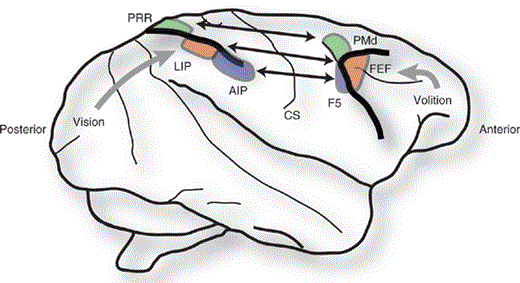
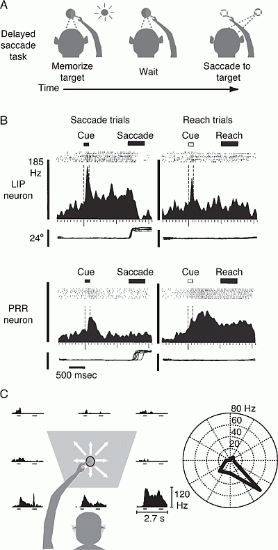
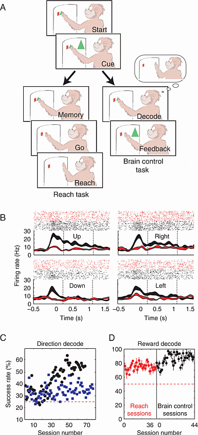
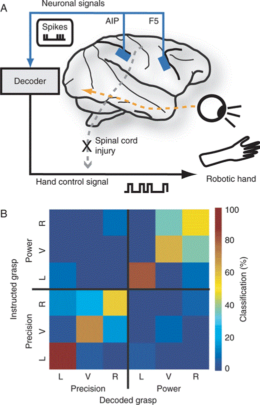

BCIs That Use Signals Recorded in Parietal or Premotor Cortex
本章回顾了顶叶和运动前皮质在运动规划中的作用，并讨论了脑机接口（BCI）研究，重点放在这些大脑区域。基于顶叶皮层和前运动皮层记录的脑机接口有可能通过提供高水平的目标相关信息来驱动计算机光标、机器人手臂或假肢的移动，从而使瘫痪患者受益。既然我们对运动意图如何在运动前区和顶叶计划区表现的原理有了合理的理解，那么通过同时真实的记录大量神经元来解码它们应该是可能的。

图 17.1显示了顶叶和前运动皮质的位置，并确定了与BCI发育特别相关的几个子区域。顶叶皮层位于初级躯体感觉皮层的后面，视觉皮层的前面，听觉皮层的中间（位于颞叶）（见第2章）。它整合了来自初级感觉区域的感觉信息，并产生了对外部世界的表征，特别是对物体和空间的表征。该信息被进一步处理以生成特定动作。例如，外侧顶内（LIP）区域中的神经元编码扫视眼球运动（快速眼球运动到特定位置）。相比之下，位于顶内沟中更内侧和更后部的顶叶到达区域（PRR）中的神经元编码即将到来的手臂到达运动的位置，并且在一定程度上编码其轨迹（Andersen et al.， 1997;Andersen和Buneo， 2002;Scherberger和Andersen， 2003），而前顶内（AIP）区域中的神经元在手抓握运动的计划和执行期间是特别活跃的（Sakata等人， 1995; Baumann等人， 2009）。

猴脑中与行动计划相关的顶叶和前运动脑区。顶叶和前运动皮质被细分为具有不同功能的特定区域。顶叶皮质区：PRR，顶骨伸展区（绿色）（手臂伸展）;LIP，外侧顶内区（橙子）（眼球运动）;AIP，前顶内区（紫色）（手抓握）。运动前皮质区：PMd，背侧运动前皮质（也是绿色）（手臂伸展）;FEF，额眼区（也是橙子）（眼球运动）;F5，运动前区F5（也是紫色）（手抓握）。功能相关区域与直接和相互的解剖投影（双向箭头，具有指示相关区域的相似颜色）连接。顶叶区域接收强烈的感觉输入，特别是视觉输入。前运动区接受意志输入。CS：中央沟。Anterior: 大脑的前极. Posterior: 大脑的后极.

在图 17.2A中，运动范例是延迟扫视任务。（扫视是快速的眼球运动到目标。）延迟扫视任务要求动物在进行扫视之前等待指定量的时间。具体地，在图 17.2A所示的延迟扫视任务中，猴子首先看向并触摸中央注视光（即，通常是发光二极管[LED]）。然后，红色目标提示灯在屏幕外围的八个可能位置之一短暂闪烁（约300毫秒）。然后猴子必须等待大约一秒钟，直到中央注视灯熄灭，此时它可以看目标（通过进行扫视），但它仍然必须继续触摸中央注视灯。因此，在红色目标光的短暂闪烁和中央注视光的熄灭之间的等待时间期间，动物必须记住目标的位置并且可以计划扫视，但是它必须抑制其执行。 如果猴子在试验中成功（即，如果它等待所需的时间，然后看着目标，同时仍然触摸中央固定灯），它会收到由少量果汁组成的奖励;如果没有成功完成试验，则不给予奖励。在任何一种情况下，动物都可以通过在一定延迟（〈1秒）后重新出现时再次注视中央注视光来启动下一次试验。

顶叶皮层的动作相关活动。(A)延迟扫视任务将行为的感觉和运动成分分离。动物们记住了一个短暂闪现的视觉目标的位置，在完全黑暗的环境中等待行动信号，然后对记住的目标位置做出一个动作（这里是扫视）。(B)在延迟扫视任务和延迟到达任务期间LIP和PRR中的意图特异性神经活动。LIP神经元（顶行，左）在扫视之前的延迟期（提示之后150-600毫秒）期间显示出升高的活性，但在到达运动之前（顶行，右）没有。相比之下，PRR神经元（底行，左）未显示扫视相关活动，但确实显示到达活动（底行，右）。每个图显示尖峰光栅（在提示呈现上对齐的八次试验，每三次显示动作电位）和对应的尖峰密度直方图。 短水平条表示目标闪光的时间（实心条：眼跳线索;open bar：reach cue）;长水平条表示运动反应（扫视或伸展）的近似时间。细水平图（每个图的底部）示出了垂直眼睛位置。垂直比例尺：神经元放电率（Hz）和垂直眼位置（度）。(C)具有右/下优选方向的PPR单元的方向调谐。左边和中间：所有到达方向（白色箭头）的尖峰密度直方图（如B中所示）。右：在延迟时段期间平均放电率的空间调谐。对于该神经元，到达活动在右/下方向上最大。（修改自Snyder等人， 1997; Scherberger and Andersen， 2003.）

延迟到达任务可以以类似的方式构造。在这种情况下，事件的顺序是相同的，除了动物在继续注视中心注视光的同时计划并执行到达目标。猴子被告知任务的类型（即，通过使用两种不同的目标颜色作为提示（红色用于扫视，绿色用于触及），对于任何给定的试验，延迟扫视对延迟触及），使得延迟扫视和延迟触及试验可以随机交错。

当动物被选择并且动物可以自由选择时（图B），神经元在两种选择下都在一定程度上活跃，但是当选择在其优选方向上时（即，右）。当动物选择了正确的目标时，神经元在整个运动过程中都是活跃的。相比之下，当动物选择左侧（非首选）目标时，神经元在目标呈现后仅短暂活跃，然后迅速下降到低于其前目标基线的活动水平。这种结果表明，顶叶和前运动皮层中的神经元最初被代表潜在运动目标的感觉刺激激活，但随后被动物的选择强烈调节，并且最终仅反映预期的运动（Platt和Glimcher， 1999;Schall和Thompson， 1999;Scherberger和Andersen， 2007）。此外，正如我们将看到的（图4和17。如图B所示，活动可以通过预期动作的预期效用或奖励来调节。因此，顶叶皮质和运动前皮质可以被视为整合感觉和认知的网络（例如，意图相关）信号以产生运动动作。

神经修复术的认知控制信号。(A)延迟到达任务和大脑控制任务，如文中所述。(B)在大脑控制任务中，神经元的活动示例，指示向上，向右，向左和向下的方向，奖励是橙子（黑色）或水（红色）。当预期得到首选奖励（橙子、黑咖啡）时，这个神经元在试验中更加活跃。(C)在两只动物（黑点和蓝点）的后续记录会话中，从四个可能的目标解码预期运动的总体成功率。虚线：概率水平（25%）。这两种动物都通过经验来提高它们的表现。(D)预期奖励的离线解码中的成功率（即，果汁或水）在三只动物的36次到达（红色）和44次脑控制（黑色）会话中。误差条表示通过交叉验证获得的标准偏差。虚线：概率水平（50%）。（改编自Musallam et al.， 2004;经AAAS许可。）

图 17.6 A显示了用于执行手抓握任务的实验BCI的设计。该BCI被设计为从顶叶区域AIP和运动前区F5中的神经元活动解码预期的手部运动。这些区域接收感觉（特别是视觉）信息，它们的神经元活动被认为代表了预期的手部运动。为了测试来自这些区域的信号可用于解码的假设，将80或128个微电极植入两只猴子的AIP和F5中（汤森等人， 2008 & 2011）。真实的记录并分类神经元活动（以区分不同神经元中的 ，参见本卷第7章和第16章），并进行最大似然解码分析方法（参见例如，Shenoy等人， 2003），其预测了延迟抓握任务的延迟时期期间来自活动的抓握类型（力量与精度）和手取向（左倾斜、垂直、右倾斜）。 然后将解码的抓握作为手抓握物体的图片呈现给动物。重要的是，对于每个正确解码的抓握，动物立即获得奖励，而不必执行运动。然而，如果试验未被正确解码，则动物不被奖励，而是必须执行正确的抓握运动以接收奖励。

猕猴AIP和F5神经元的手抓握信号解码。(A)解码示意图。在瘫痪的患者中，运动指令不再能从大脑传递到运动效应器（灰虚线）。这种缺陷可以通过直接在大脑（蓝色垫）中进行并在外部处理的神经记录来绕过。(B)混淆矩阵（见正文），指示对AIP和F5中80个永久植入电极的抓握类型（功率vs.精度）和抓握方向（向左倾斜[L]、垂直[V]或向右倾斜[R]）进行解码的性能。数据示出了具有约180次解码试验的一个在线解码会话的结果。如果解码性能是完美的，则100%的试验将在从左下角到右上角的对角线上对齐。这里，对角线显示了在所有六种条件下72%的平均性能。（修改自汤森等人， 2008和2011年。）