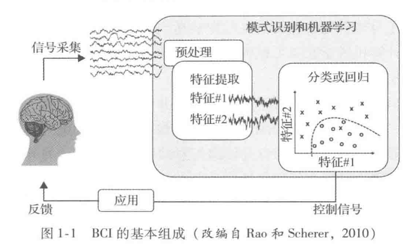

## BCI的基本组成
BCI的实现通常涉及以下一个或多个处理步骤

1. 脑信号的记录: 利用侵入式或非侵入式的技术来记录大脑产生的信号。
2. 信号处理: 将采集到的原始信号进行预处理(例如:进行带通滤波)，并应用**伪迹去除和特征提取**技术。
3. 模式识别和机器学习: 这一阶段**通常利用机器学习技术，根据输人信号模式产生控制信号**。
4. 感知反馈: BCI产生的控制信号会导致环境的变化(例如:假肢或轮椅的移动，假手抓握力的改变)。其中的一些改变可以被使用者看到、听到或感受到，但是通常人们可以在这些变化的环境中使用传感器，例如触觉传感器、压力传感器、照相机和手机，并利用这些来自传感器的信息进行刺激，从而向大脑提供直接的反馈。
5. 刺激信号处理: 在刺激一个特殊的脑区之前，创建一个刺激活动模式十分必要，该刺激模式要求能够模拟脑区常见的活动，并达到预期的效果。这就需要对被刺激的脑区有深刻的理解，以及使用能够产生正确刺激模式的信号处理技术(和潜在的机器学习技术)。
6. 脑刺激: 利用侵入式或非侵人式的刺激技术将从信号处理环节接收到的刺激模式用于刺激大脑。

从上面列出的用于构建 BCI的处理步骤中可以清楚地看出，人们至少需要具备以下四大领域的背景知识: **基础神经科学、大脑信号记录和刺激技术、基本的信号处理技术、机器学习技术**。BCI的初学者通常仅具备一个领域的背景知识，并没有全面了解上述所有领域。因此，我们首先介绍有关这四个领域的基本概念和方法(第一部分)，开启了解 BCI世界的旅途。