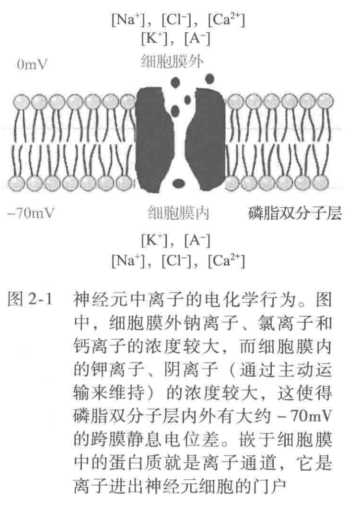
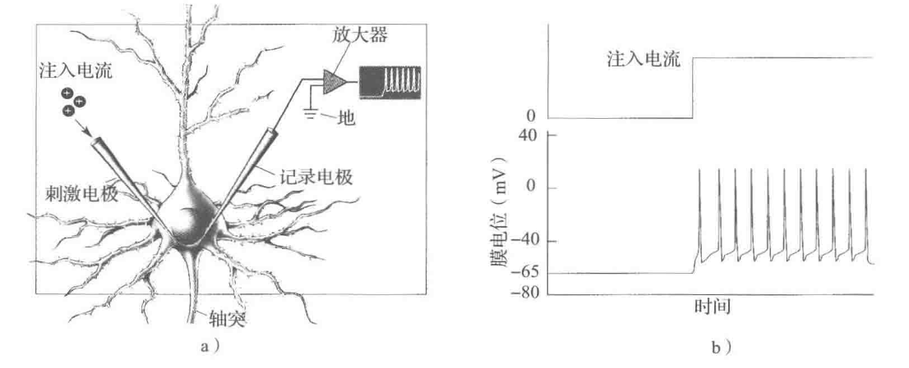
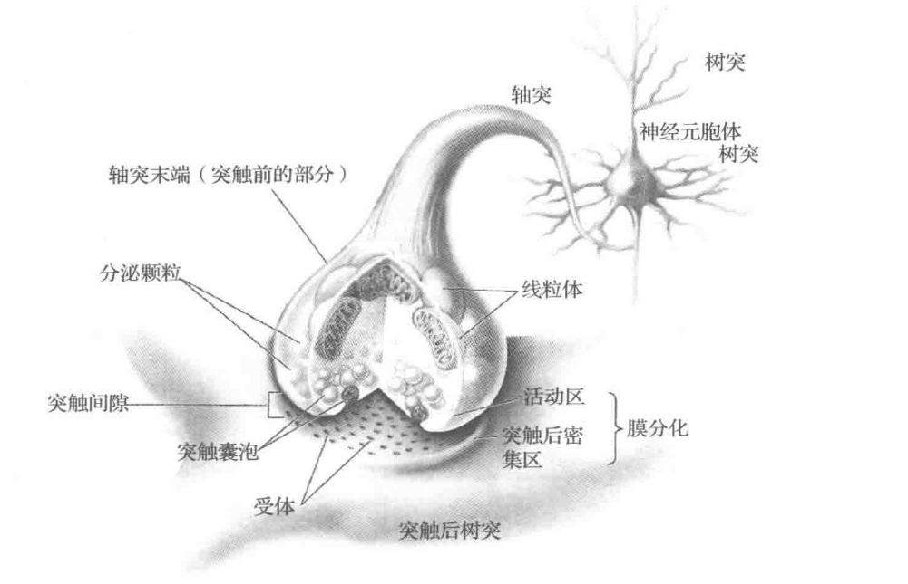
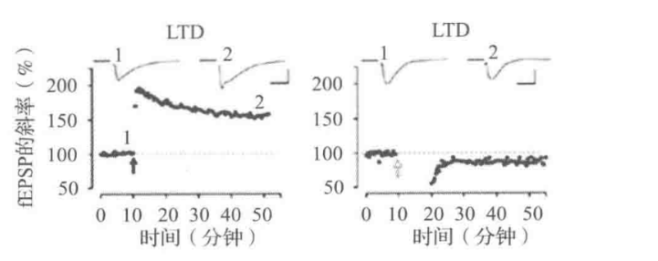
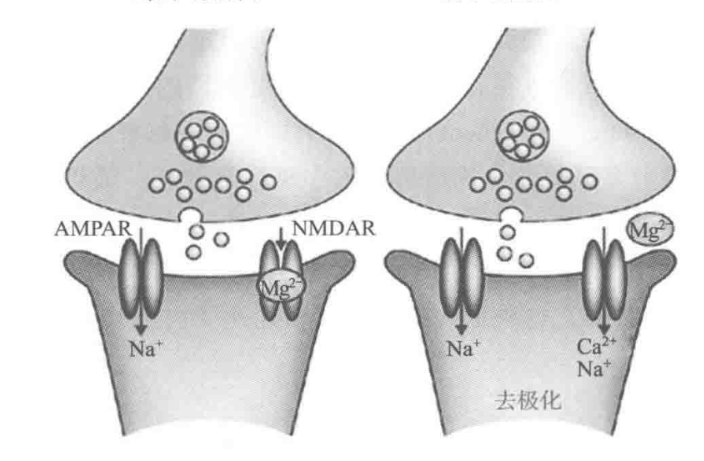

重量仅三磅(1磅合0.45359237千克)的人类大脑堪称进化史上的奇迹。大脑将数以百万分布于身体各处的感知信息转变成适当的指令，使肌肉能对当前环境做出适宜的反应。而计算机科学家和工程师经过几十年不懈努力模拟的人工系统始终无法超越大脑的闭环实时控制系统。
人脑独特的信息处理能力得益于其大规模的并行和分布式计算方式。承担大脑信息处理任务的是一种称为神经元的细胞，神经元像一个复杂的电化学设备，负责从其他数百个神经无获取信息、处理信息并传递信息给其他神经元。另外，**神经元间的连接是可塑的**，这使得大脑的神经网终能适应新的输入和变化的环境。这种自适应和分布式的计算模式使大脑与传统的计算机具有较大差别，因为传统计算机是基于冯·诺依曼结构，由独立的中央处理器单元和存储单元组成，元件之间保持固定的连接并采用串行计算模式。

## 神经元
神经元是一种细胞，通常被认为是神经系统最基本的计算单元。打个粗略的比方，神经元可以看成一个装有带电液体但有漏洞的袋子。神经元的细胞膜由磷脂双分子层构成如图(2-1)，这种防渗层中具有离子通道，可以选择性地让一些特定类型的离子通过神经元存在于水介质中，其细胞外的钠离子(Na+)、氯离子(Cl-) 和钙离子 (Ca2+)浓度大于细胞内，而细胞内的钾离子(K+)和阴离子(A-)浓度则大于细胞外(如图2-1)。由于离子浓度的不平衡，**神经元细胞存在约-60mV到-70mV的跨膜静息电位差，该电位差由细胞消耗能量来保持**。

## 动作电位与锋电位
当神经元从其他神经元处接收到足够强的输入之后 (见2.4 节)，将会触发一连串的事件:
**Na+离子迅速流入细胞内，造成细胞膜电位迅速升高，直到 K+离子通道打开，触发 K+离子流出细胞，使得膜电位下降。膜电位快速上升和下降的现象称为动作电位或锋电位(如图2-2)，这是神经元间通信的主要模式**。
**锋电位波形基本是固定的，其波形本身仅携带少量信息或者完全不携带信息，真正携带信息的是锋电位的放电率(每秒钟出现的锋电位的数量) 和锋电位出现的时间。因而神经元可以用具有0或1数字输出的模型来表示。**
类似地，在对清醒状态下的动物所进行的细胞记录实验中(见3.1.1节)，锋电位常用在其出现时刻的一根短柱条来表示。

图2-2. 锋电位或动作电位的产生。
a) 图描述了用刺激电极向神经元细胞体内注人电流(阳离子)和用记录电极记录细胞膜电位变化的实验过程;
b) 图展示了在注人足够大的电流之后产生的一系列锋电位或动作电位。每个锋电位具有固定的波形，它快速上升到0mV以上，又迅速下降回初值。每次下降后，稳定的注入电流又使得电位呈斜坡上升至稍低于 -40mV (对该神经元)的阈值处，此时细胞将再次放电(Bear 等人，2007)

神经元产生锋电位是一个复杂的过程，涉及如前所述的钠离子、钾离子流入、流出离子通道等一连串的事件。然而在很多情况下，这一过程可以简化为一个简单的锋电位产生的闽值模型。当神经元从突触那里获得足以使其膜电位超过一个特定阙值的输入时，就会产生锋电位(如图 2-2b)。这样，神经元可以看成是一台混合的模-数计算设备，它将数字输入0/1 转换成局部膜电位的模拟变化，这些模拟变化在神经元胞体中进行求和，如果总和超过闽值则产生锋电位。当然，这种简化模型忽略了与树突相关的信号处理中的一些复杂而又潜在的重要模式，但神经元的阙值模型在神经元建模与人工神经网络的应用中可以作为神经元的有效抽象。

## 突触、树突、轴突
大脑不同脑区的神经元有着不同的形态结构，但都包括一些典型结构。其中，细胞体 (称为神经元胞体) 连接带分支的树形结构的树突，树突的一个分支称为轴突轴突源于神经元胞体，并将神经元的输出锋电位传送到其他神经元(如图2-3)。锋电位起始于神经元胞体和轴突的连接点附近，并沿轴突方向向下传播。许多轴突被髓磷脂覆盖，**髓磷脂是一种白色的髓鞘，它能显著提高锋电位长距离传输的速度**。**白质由连接大脑不同区域的带髓鞘的轴突聚集而成，而灰质主要由细胞体聚集而成**。

神经元间通过称为突触的连接进行交流。**突触表现出电特性，但更多表现为典型的化学特性**。**突触本质上是一个神经元(称为突触前神经元) 的轴突与另一个神经元(称为突触后神经元) 树突(或神经元胞体) 的间隙或裂缝(如图2-3)**。当从突触前神经元产生的动作电位到达突触间隙时，会向间隙释放一种称为**神经递质**的化学物质这些化学物质附着于突触后神经元的离子通道(也称**受体**)上，使**离子通道打开**，从而影响突触后细胞的局部膜电位。

图2-3. 树突、神经元胞体、轴突与突触。图中描述了两个神经元细胞之间的连接情况。展示出前一神经元的树突、细胞体(神经元胞体) 和轴突。该轴突沿着突触与后一神经元的树突相连接。前一神经元传送来的锋电位引起存储在突触前神经元轴突端部突触囊泡中的神经递质释放。这些神经递质附着于后一神经元树突的受体上，造成离子通道的打开。从而使离子流进或流出细胞，导致突触后神经元局部膜电位的变化(改编自Bear 等人，2007)

突触可以处于兴奋或抑制的状态。顾名思义，兴奋性突触使突触后细胞的局部膜电位瞬时上升。这个上升电位称为**兴奋性突触后电位(excitatory postsynaptic potential，EPSP)**。EPSP 提高了突触后细胞产生锋电位的可能性。相反，抑制性突触产生**抑制性突触后电位(inhibitory postsynaptic potential，IPSP)**，可以暂时降低突触后细胞的局部膜电位。一个神经元处于兴奋还是抑制状态，是根据它形成的突触类型以及突触后神经元来决定的。**每个神经元只形成一种突触，因此一个兴奋性神经元需要抑制另一个神经元那它必须先使一个抑制性的“中间神经元”兴奋，然后通过其去抑制目标神经元。**

## 突触可塑性
**大脑具有适应能力，其关键原因在于神经元可以通过突触可塑性来改变神经元之间的连接强度**。研究人员通过实验观察到了突触可塑性的多种形式，其中研究最多的形式是`长时程增强 (long-term potentiation, LTP)`和`长时程抑制 (long-term depression, LTD)`，这两种形式中突触的变化均可持续数小时甚至数天。最近，研究人员又发现了其他类型的突触可塑性，其中包括`时序锋电位的可塑性(spike timing dependent plasticity，STDP)`，在这种形式中，输人与输出锋电位的相对时间决定了突触变化的极性:另外还有`短时易化或抑制`，这种形式的突触可塑性速度快，但持续时间不长。
### LTP or LTD
LTP 是突触可塑性中最重要的形式之一(如图2-4)。LTP 最简单的一种形式是以两个神经元间相关的放电活动来增强它们之间突触连接的强度。LTP 从生物学方面实现了Donald Hebb的著名假说(也称为 Hebbian学习或Hebbian 可塑性)。根据Hebb的假说，`如果A神经元持续地参与激发 B神经元的活动，那么AB神经元之间的连接强度就会增加`。在海马和新皮质等脑区中已经发现了 LTP的存在。相反，如果这种突触连接很少被激活，那么这种连接的强度可能会减少，这被称为长期抑制(LTD)。通过突触可塑性的机制，神经元之间的连接可以根据经验和环境的变化来改变，从而支持学习和记忆等复杂的认知功能。

### STDP
**STDP(时序相关性依赖性塑性)，即时序相关性依赖性突触可塑性**，是一种突触可塑性的现象。它描述了神经元之间的突触连接强度如何随着神经元之间的时间序列的差异而改变。
STDP通常表现为以下规律：当神经元A的动作电位在神经元B之前发生，且这两个神经元之间的突触处于活跃状态时，突触连接将被增强；相反，如果神经元B的动作电位在神经元A之前发生，且突触处于活跃状态，突触连接将被削弱。这意味着，突触的连接强度会随着神经元之间的相对时间顺序而发生变化。
近来的研究表明，对突触前与突触后锋电位精确的时间控制能决定突触强度的变化是正的还是负的。这种形式的突触可塑性被定义为 STDP。在Hebbian STDP这种形式中，**当突触前锋电位稍稍超前于突触后锋电位时 (例如，超前1~40ms)，突触强度增加;而当突触前锋电位稍稍滞后于突触后锋电位时 (例如，滞后1~40ms)，突触强度减弱。在哺乳动物的大脑皮质和海马体中已经发现了 HebbianSTDP的存在**。反 Hebbian STDP 则会出现完全相反的现象，当突触前锋电位滞后于突触后锋电位时，突触强度增强，反之亦然。在一些结构中可以观察到这种现象，特别是在小脑的抑制性突触中，弱电鱼就有这种结构。STDP是一种非常基础的神经计算机制，并且已经在许多神经元模型中得到广泛应用。此外，STDP也在神经科学研究中发挥着重要作用，在揭示记忆和学习等认知过程中，STDP的机制也被广泛地运用。

> 图2.4-突触可塑性。上面两图证明海马体中存在 LTP 和LTD的实验数据。突触强度定义为兴奋性突触后电位(slope of the excitatory postsynaptic potential，EPSP)的斜率。其中左图表示LTP，高频刺激 (100Hz 持续刺激1秒:用黑色箭头指示刺激的时刻)引起突触强度长时间持续增加。右图表示由低频刺激引起的 LTD(进行两次5H 的刺激，每次刺激持续3 分钟之间有3分钟的间隔:用空心箭头指示刺激时刻)。图中比例尺为:0.5mV与10ms。
> 下面两图是突触可塑性的模型。AMPAR和NMDAR是两种离子通道。在弱刺激下(左图)，由于NMDAR通道中Mg+离子的阻碍作用，Na离子能从AMPAR 通道通过，但是不能从NMDAR通道通过。如果突触后细胞发生去极化(右图)，则消除了Mg离子对NMDAR通道的堵塞，这样 Na"离子和 Ca*离子都可以流入。Ca离子浓度的增加是产生突触可塑性的必要条件(改编自Citri&Malenka，2008) 

### 短期抑制和激励
前面讨论的突触可塑性都属于长期可塑性，这是由于所引起的变化能长达数小时数天，甚至更长的时间。第二类突触可塑性是具有短暂影响的可塑性。这种可塑性称为短期可塑性，相应的突触对输人的锋电位模式起着时域滤波器的作用。例如，在新皮质中发现的短期抑制(STD) 中，输入锋电位序列中的每一个锋电位产生的影响都比它前一个锋电位产生的影响有所减弱。因此，当神经元接收到一串锋电位时，第一个锋电位对膜电位变化产生的影响最强，随后的锋电位产生的影响依次减弱，直到达到平衡点为止。随后的锋电位对突触后神经元产生的影响相同，而短期激励 (STF)则起着相反的作用，每个锋电位都比它前一个锋电位产生的影响要强，直至达到饱和点为止。通过控制输入锋电位序列对突触后神经元的影响作用，STD与STP对于调控皮质网络的动态特性起着重要的作用。