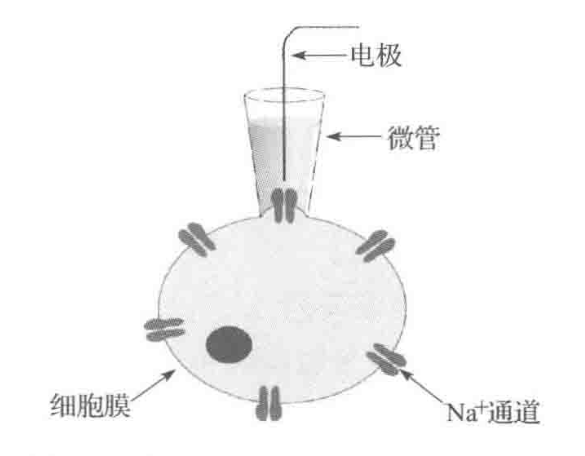
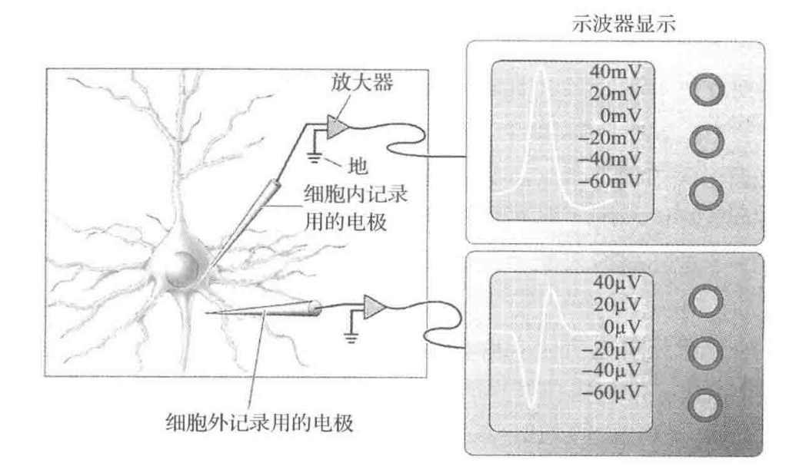
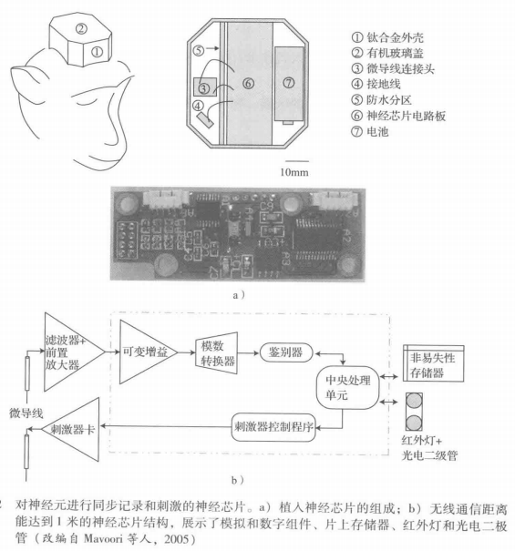

**能从大脑的单个神经元记录信号的技术往往是侵入式的**，需要借助一定形式的外科手术来实现，其过程为移除一部分颅骨，在大脑中植入电极或植入物，再将移除的颅骨部分放回原处。侵入式的记录方式往往用于动物，例如猴子和老鼠。因为大脑没有内部疼痛感受器，所以记录本身并不会带来痛苦，但是手术和恢复过程中会产生疼痛以及感染等风险。记录可以在麻醉或者清醒的动物身上实施，然而在清醒的状态下进行记录时，动物的活动往往是受限的，以使由动物大的动作引起的伪迹最小化。对人类而言，侵入式记录只在临床中应用，比如在脑外科手术中或在手术前监控病人的异常大脑活动(如癫痴)。对于一些动物(如猴子) 而言，记录时间可持续几周、几个月甚至几年，而对于人类，记录时间从几周、几个月到临床环境下的几天或者几分钟不等。侵入式记录的一个主要优点是**该方法可以记录毫秒级的动作电位 (公认的神经元输出信号)**。与侵入式技术相比较，非侵入式技术测量与神经活动间接相关的时间尺度更大(几百毫秒)的信号，如血流量。应用于人和动物的侵入式记录都是基于电极的技术。

## 微电极
微电极是一种用于连接脑组织的极细金属丝或者其他导电体。一个典型的微电极由**钨**或者**铂钵合金**制成，除了端部，其余部分绝缘，**测量直径约为 1um (一个神经元的直径在几十微米范围内)**。在某些情况下 (特别是细胞内记录，见下一节)，神经学家也使用一个填充了**弱电解质溶液的玻璃微管电极**，该电解质溶液与细胞内液类似。

测量神经元活动最直接的方法是测量神经元细胞膜电压或电流的细胞内记录。最常用的技术称为膜片钳记录 (图3-1)，该技术采用了一个端部直径为 lm 或者更小的玻璃微管，其中填充了类似于细胞中的细胞内液离子组成的弱电解质溶液。一根银丝插入移液管中用于连接电解质和放大器。电压是相对于一个放置在细胞外的细胞外液中的参考电极进行测量的。为记录细胞信号，玻璃微电极放置于细胞旁，并用温和的吸力将一片细胞膜(一个“膜片”) 吸入电极端部，从而在细胞膜上形成高阻抗的密封。鉴于这过程的精巧性，细胞内记录通常只在脑组织切片上(“体外”)进行，很少在活体动物的完整大脑上(“体内”)进行。因此，相较于细胞外记录，这种技术在BCI中较少使用。

`使用膜片钳技术的细胞外记录该技术可以在一小片细胞膜或者整个细胞上进行离子电流的测量(图片源自TKnott的Creative Commons)`

一种最常见的侵入式技术，特别是在动物的完整大脑上实施的，是**单个神经元(或“单个细胞”)的细胞外记录**: 将端部尺寸不到10微米的由钨或者铂钵合金制成的微电极插入到目标脑区。**调整微电极的深度直至足够接近一个细胞体，以采集由细胞动作电位引起的电压波动**(图3-2)。电压波动是以相对于连接至颅骨螺钉的“地”或基准点来测量的。记录到的信号幅值通常不到1毫伏，因而需要使用放大器来检测信号。因为电压波动同动作电位直接相关，所以即使电极没有插入细胞，记录的信号也显得和动作电位一样:当产生一个动作电位时，带正电荷的钠离子进入细胞，会在细胞附近区域产生一个相对于参考电极的负电压波动 (见图 3-2下方的示波器显示)。这一波动被记录电极采集到。将放大器的信号输入给计算机，由计算机对信号进行进一步的处理，比如**滤除噪声和分离锋电位**(动作电位)。

`细胞内与细胞外锋电位的记录。右边两个示波器图比较了用细胞内 (顶部) 和细胞外(底部)方式记录的动作电位(锋电位)。细胞内记录测量细胞内 (电极的端部) 和置于神经元外溶液中的外部电极(“地”)之间的电位差。细胞外记录测量细胞外电极端部(置于紧邻神经元外侧的位置)与地电极之间的电位差。当神经元产生一个锋电位时，正离子从细胞外电极流入神经元内引起示波器中的初始负偏差。当动作电位降低时，正电荷从神经元流向细胞外电极，紧接着就出现一个正偏差。注意细胞内和细胞外信号在尺度上的差异。在每个锋电位出现的时候，细胞外锋电位通常用一根短的垂直坚条简单表示(如图7-5a)(源自Bear 等人，2007)`

## 微电极阵列
为记录更多数量的神经元，微电极可以排成一个网状结构，形成一个 mxn的多电极阵列，其中m和n的取值范围通常在1到10之间 (图3-3)。这种阵列已经被用于体外和体内的记录中。这里我们只关注用于体内记录的植人阵列，因为它与BCI的关联最密切。

植入阵列中最常见的类型是微导线、硅基和柔性微电极阵列。微导线阵列采用钨、铂合金或者不锈钢电极，与前一节讨论的四极管类似。硅基阵列包括称为Michigan 和Utah的阵列。前者**允许通过整个电极记录信号**，而不仅仅由电极端部进行记录。这两种阵列都比微导线阵列具有更高的密度和空间分辨率。柔性阵列进行记录时依靠的是聚酷亚胺、聚对二甲苯或者苯并环丁烯而非硅，从而更好地匹配了脑组织的力学性能，降低了由硅基阵列造成的剪切诱导炎症的可能性。

多电极阵列基于与单电极记录时的相同现象来检测动作电位:动作电位产生时，钠离子快速涌入细胞内，造成细胞外空间的电压急剧变化，这一变化由阵列中与该细胞邻近的电极检测到。多数情况下，由于一些电极不能提供可用的信号，**能够同时记录的神经元数量比阵列中电极的实际数量少10%到50%**。多电极阵列优于更常规的单电极系统的原因主要在于其更高的空间分辨率。能同时记录几十个神经元的能力使提取复杂类型的信息成为可能，比如提取可以用于控制假肢设备的位置或速度信号。

植入阵列也有缺点，尤其是当植入设备长期存在于脑组织中 (因为要求长期控制假肢)。特别是神经胶质细胞这种非神经元细胞包围着植入设备，会导致**早期疤痕组织**的形成，从而在阵列周围形成绝缘护套，增加了电极的阻抗。**这种对植入设备的生物反应会导致记录信号的质量随着时间的推移显著下降，降低了其在 BCI中的有效性** 对植入物的生物相容性进行的研究试图通过在设备外涂抹一层聚合物或者其他物质来解决这些问题。

## 神经芯片
神经芯片(Neurochip)(图3-12) 是一种集成芯片实例，用于从一个或者多个神经元记录信息，执行有效的信号处理和其他计算，并且基于这些计算结果向一个或者多个神经元传递刺激 (Mavoori 等人，2005)。这种芯片是一个独立的装置，它允许植人芯片后的受试者自由走动以及进行正常活动。靠电池供电的芯片由 12 个可移动的微钨丝电极阵列组成(直径50mm;阻抗0.5MV;电极间距500mm)。该芯片包含一个微处理器，它能对来自一组电极的信号进行锋电位分类 (4.1节)，并命令刺激器电路通过另一组电极传送电脉冲。记录信号的短片段和所需的刺激模式可以存储在芯片的存储器上。

## 思考问题
### 1. 目前可用于记录大脑信号的侵入式技术有哪些?说明各项技术能否从单个神经元记录锋电位。
目前可用于记录大脑信号的侵入式技术有微电极、电极阵列和光遗传学等。这些技术都是通过将电极或光探针插入到大脑组织中，直接记录神经元活动来实现的。
在这些技术中，微电极是最早被使用和广泛采用的技术之一。它可以从单个神经元中记录锋电位，并用于测量神经元的放电率、时序和空间分布等信息。
电极阵列则是一种高通量的记录技术，它能够同时记录多个神经元，并提供更广泛的空间覆盖范围。不过，由于阵列中的每个电极尺寸较小，因此无法从单个神经元中记录锋电位。
光遗传学技术则利用了光敏化蛋白质与线粒体和突触的结合，实现了对单个神经元的记录和调控。这项技术可以在细胞水平上测量神经元的电活动，并实现精确的光刺激，但对于大规模神经元网络的记录还存在一些限制。
总的来说，这些侵入式技术均可以记录大脑神经元的电活动，但在空间分辨率和记录数上存在一定的差距。选择适当的技术需要考虑实验目的、神经元类型和研究深度等因素。

### 2. 解释细胞内和细胞外记录之间的区别。哪一个技术通常用于记录清醒的活体动物?
细胞内和细胞外记录是记录神经元电活动的两种主要方式。细胞内记录通常通过将微电极或纳米电极插入单个神经元中，测量神经元膜电位的变化。而细胞外记录则是通过在神经元周围的组织中放置电极或阵列，在神经元放电时记录电流信号。

相比之下，细胞内记录提供了更高的信噪比和更准确的信号，因为电极直接与神经元相连。同时，它也可以提供更详细的信息，如单个神经元的放电发放和幅度。但是需要注意，细胞内记录需要击穿神经元的膜，有损神经元的完整性和稳定性。

而细胞外记录虽然无法提供单个神经元的放电信息，但可以从大面积神经元网络中获取数据，并且对于清醒的活体动物的记录更加方便和可行。

因此，通常情况下，细胞外记录更适合用于记录清醒的活体动物，而细胞内记录则更适用于类似于离体组织、小型生物等更局限的情境。选择哪种记录技术应该根据具体的实验条件、测量要求和研究目的来决定。

