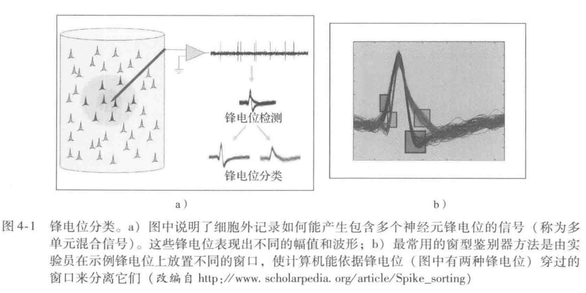
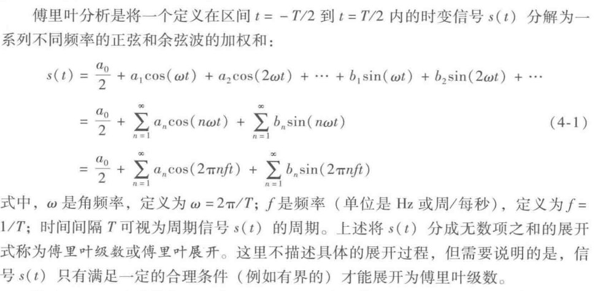
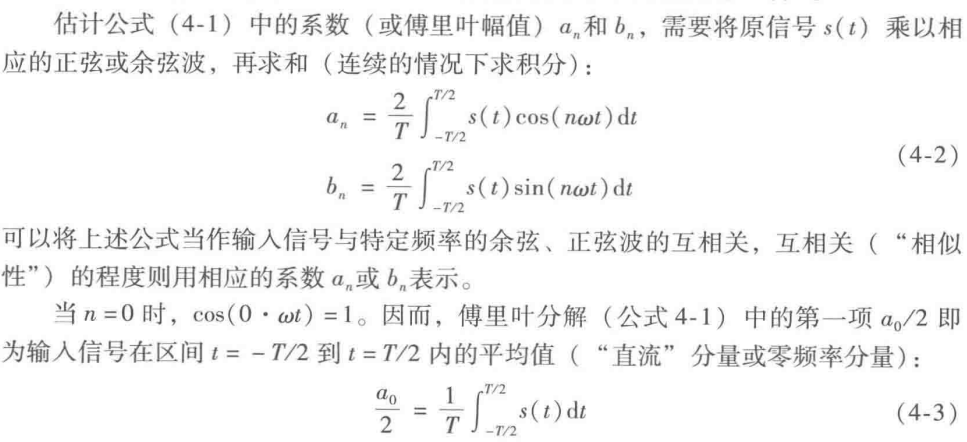
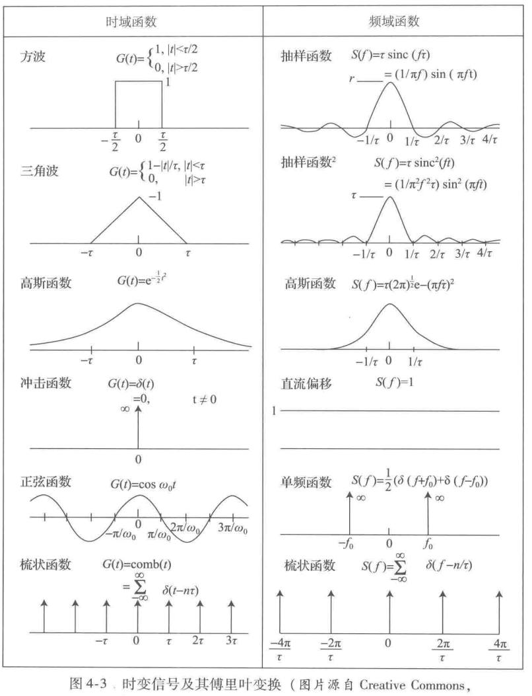
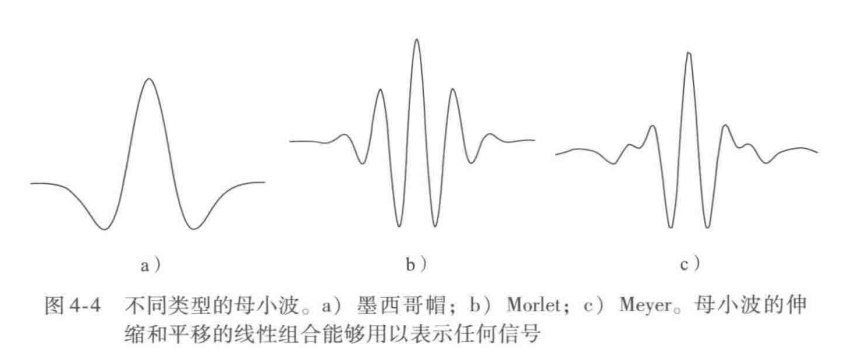

本章将回顾 BCI中对记录的大脑信号的处理方法，信号处理的任务包括从侵入式电极所记录的原始信号中提取锋电位，以及提取用于分类的特征。

## 1. 锋电位分类
用于 BCI的侵人式方法通常依赖于由微电极阵列记录到的锋电位。对这样一种输入信号进行信号处理的目的是可靠地分离和提取每个记录电极采集的由单个神经元发出的锋电位，这一过程通常被称为锋电位分类。
由植入大脑的细胞外电极记录的信号通常是由电极附近的数个神经元所产生的信号混合而成，距离越近的神经元产生的锋电位在记录信号中产生的幅值偏差越大。这此信号称为**多单元混合信号或神经混合信号** (图4-1a)。虽然这种信号也可能作为 BCI的输人信号，但更传统的输入信号形式仍是来自单个神经元的锋电位。锋电位分类方法就是将单个神经元产生的锋电位从混合信号中提取出来。
锋电位分类方法中最简单的一种是根据峰值幅度来对锋电位进行分类。当细胞外电极从距离相近的几个神经元处获取到很强的信号时，会得到不同的信号幅度，该方法在这种情况下是有效的。然而在很多情况下，不同神经元产生的锋电位的峰值幅度可能是相同的，这使得按峰值幅度分类的方法不可行。很多商业化的系统都采用了一种称为窗型鉴别器的方法。在这种方法中，实验员通过肉眼来观察数据，并在一排具有相同波形的锋电位上加窗 (图4-1b)。该方法将之后穿过一个或多个相同窗的锋电位归为由同一个神经元产生。这种方法的缺点是需要实验员人工标记不同神经元产生的锋电位。最近的趋势是根据波形将锋电位自动归类为不同的组，其中每一组锋电位视为由同一个神经元产生。锋电位的波形可由一些特征来定义，通过小波或主成分分析(principalcomponentanalysis，PCA)来提取这些特征(见4.3节和4.5节)。

## 2. 频域分析
### a. 频域分析
#### 傅里叶分析
基本思想是将一个信号分解为不同频率的正弦和余弦波的加权和
$$f(x) = \frac{a_0}{2} + \sum_{n=1}^\infty \left(a_n \cos\left(\frac{n\pi x}{L}\right) + b_n\sin\left(\frac{n\pi x}{L}\right)\right)$$

目前这部分完全不懂

* 可以参考：
  [《信号与系统》中国大学MOOC](https://www.icourse163.org/learn/XDU-483006?tid=1469708456#/learn/content)
#### 离散傅里叶变换
略去

#### 快速傅里叶变换
略去

#### 频谱特征
略去

#### 小波分析
傅里叶变换是用“基函数”集来表示一个信号，这些“基函数”是不同频率的正弦和余弦函数。然而，正弦和余弦函数的时域范围为无限长，因此**傅里叶变换用于表示有限长的非周期函数或是有尖峰和不连续点的函数的效果较差**。而且，EEG 等大脑信号是非平稳信号(即统计特性随时间改变)，这就不满足傅里叶分析的平稳性假设解决这一问题的一种方法是在短时窗内进行傅里叶分析，这种方法称为短时傅里叶变换(short-time/short-term Fourier transform，STFT)。然而，STFT也存在选择窗口宽度的问题，窄窗口的时间分辨率高，但频率分辨率低;宽窗口的频率分辨率高，但时间分辨率低。这一矛盾推动了小波变换的发展，**小波变换试图在时间分辨率和频率分辨率之间寻找最佳的平衡点。小波变换(wavelet transform，WT)的基函数不再是正弦和余弦函数，而是有限长的称为小波的函数，小波函数是由一个有限长的母小波 (如图4-4 所示) 通过伸缩和平移得到的**。小波变换通过使用不同尺度的基函数实现对信号的多分辨率解析，较大尺度的基函数展示输入信号较为粗糙的特征，较小尺度的基函数则展示更精细的特征此外，小波函数 (不同于傅里叶分析中的正弦和余弦函数) 有限的长度使其可以用来表示非周期信号或是有陡变不连续点的信号。

正如傅里叶变换一样，小波变换用基函数(小波) 的线性组合来表示原信号(如图4-5)。小波变换用相应的小波系数来分析信号。当前大部分的信号处理包都包含小波变换这一可用选项，并且提供了多种可选的母小波